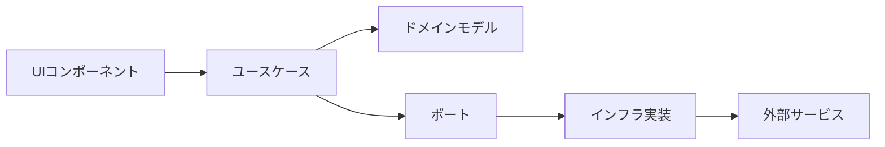

# 減価償却計算アプリ - 要件定義・技術選定書

アプリ名「にちわり！」

## 1. プロジェクト概要

### 1.1 目的
物を買うときに減価償却理論に基づいて、何年持つかから日割り換算して、本当に必要かどうか、買った方がお得か・自分が幸せになれるか判断できるWebアプリケーション

### 1.2 主要コンセプト
- **減価償却理論の日常応用**: 購入価格を使用期間で割って日割りコストを算出
- **科学的根拠に基づく購買判断**: 幸福度研究に基づいたチェックリスト
- **データドリブン**: トレンド分析と参考データの提供

## 2. 機能要件

### 2.1 コア機能

#### 2.1.1 減価償却計算機能
```yaml
入力:
  - 商品名（テキスト、最大100文字）
  - 価格（数値、0〜10億円）
  - 予想使用年数（数値、0.5〜100年、0.5年刻み）

処理:
  - 日割りコスト = 価格 ÷ (年数 × 365)
  - 月割りコスト = 日割りコスト × 30
  - 年割りコスト = 価格 ÷ 年数

出力:
  - 1日あたりのコスト（円）
  - 月額換算（円）
  - 年額換算（円）
  - 総使用日数
  - 比較指標（コーヒー代、ランチ代など）
```

#### 2.1.2 商品サジェスト機能
- 商品名入力時に参考データから候補を表示
- 選択すると平均価格と耐用年数を自動入力

#### 2.1.3 参考データベース
```yaml
カテゴリ:
  - 家電
  - ファッション
  - 家具
  - ガジェット
  - スポーツ
  - 趣味

データ構造:
  name: string        # 商品名
  price: number       # 平均価格
  years: number       # 平均耐用年数
  category: string    # カテゴリ
  icon: string       # 表示アイコン
```

#### 2.1.4 幸福度診断機能
```yaml
チェックリスト項目:
  - 毎日または週に数回は使用する予定
  - 長期的に価値が持続する（流行に左右されない）
  - 生活の質や効率が明確に向上する
  - 同等の代替品やレンタルでは満足できない
  - 維持費が収入の5%以下である
  - 購入後1ヶ月経っても欲しいと思っている
  - 体験や思い出作りに寄与する
  - 健康や学習など自己投資になる

スコアリング:
  70%以上: 購入する価値が高い
  40-69%: もう少し検討が必要
  40%未満: 再考を推奨
```

#### 2.1.5 データ収集・トレンド機能
- 匿名で検索データを収集（商品名、価格帯、耐用年数）
- 人気商品ランキング表示（上位5-10件）
- よく調べられている商品の表示

### 2.2 科学的根拠Tips
```yaml
掲載する研究ベースのTips:
  - 経験vs物質: 経験への投資の方が長期的幸福度向上（Gilovich & Kumar, 2015）
  - 適応の法則: 高価な買い物の幸福感は3-6ヶ月で元に戻る（Kahneman & Deaton, 2010）
  - 時間を買う: 時間節約商品が最も効率的に幸福度向上（Whillans et al., 2017）
  - 比較の罠: 他人との比較での購入は満足度低下（Solnick & Hemenway, 1998）
  - 遅延満足: 30日ルールで衝動買いの70%を防止（Ariely & Wertenbroch, 2002）
  - 80/20ルール: 多機能製品の実使用機能は20%程度（Nielsen Norman Group, 2020）
```

## 3. 非機能要件

### 3.1 パフォーマンス要件
```yaml
初回ロード: 3秒以内
計算結果表示: 即座（< 100ms）
Lighthouse Score:
  Performance: 90以上
  Accessibility: 100
  Best Practices: 90以上
  SEO: 90以上
```

### 3.2 アクセシビリティ要件
```yaml
準拠基準: WCAG 2.1 Level AA
必須要件:
  - キーボードのみで全機能操作可能
  - スクリーンリーダー完全対応
  - 適切なARIAラベル
  - 十分なコントラスト比
  - フォーカス管理
  - エラーメッセージの明確な表示
```

### 3.3 対応環境
```yaml
ブラウザ:
  - Chrome/Edge: 最新2バージョン
  - Firefox: 最新2バージョン
  - Safari: 最新2バージョン
  
デバイス:
  - デスクトップ: 1024px以上
  - タブレット: 768px-1023px
  - モバイル: 767px以下
```

## 4. 技術スタック

### 4.1 フロントエンド
```yaml
フレームワーク:
  name: Nuxt 3
  version: 最新安定版
  mode: SSG（静的サイト生成）
  
言語:
  TypeScript: 
    strict: true
    
UIライブラリ:
  name: Volt (PrimeVue + Tailwind)
  理由: 
    - Code Ownershipモデルで完全制御可能
    - WCAG AA準拠のアクセシビリティ
    - PrimeVueの豊富なコンポーネント
    
CSS:
  name: Tailwind CSS v4
  config: CSS-firstアプローチ
  
状態管理:
  name: Pinia
  
バリデーション:
  name: Valibot
  理由:
    - 極小バンドルサイズ（Zodの10%）
    - TypeScript完全サポート
    - モジュラー設計
```

### 4.2 バックエンド・データ
```yaml
データベース:
  name: Supabase
  features:
    - PostgreSQL
    - リアルタイム同期
    - 匿名認証（データ収集用）
    
分析:
  - Supabase Analytics
  - カスタムイベントトラッキング
```

### 4.3 開発環境
```yaml
パッケージマネージャ: pnpm
Node.js: v20 LTS（Voltaで管理）

テスト:
  単体テスト: Vitest
  UIテスト: @testing-library/vue
  E2E: Playwright
  カバレッジ目標: 80%以上

コード品質:
  Linter: ESLint + @antfu/eslint-config
  Formatter: Prettier
  型チェック: TypeScript strict mode
  
Git:
  Hooks: Husky + lint-staged
  コミット規約: Conventional Commits
  
CI/CD:
  platform: GitHub Actions
  デプロイ: Vercel（無料枠）
```

## 5. アーキテクチャ設計

### 5.1 Clean Architecture + Feature Slicing

```
src/
├── core/                          # ビジネスロジック層
│   ├── domain/                    # ドメインモデル
│   │   ├── entities/
│   │   │   ├── Product.ts        # 商品エンティティ
│   │   │   ├── Calculation.ts    # 計算結果エンティティ
│   │   │   └── HappinessScore.ts # 幸福度スコアエンティティ
│   │   ├── valueObjects/
│   │   │   ├── Money.ts          # 金額値オブジェクト
│   │   │   ├── Years.ts          # 年数値オブジェクト
│   │   │   └── DailyCost.ts      # 日割りコスト値オブジェクト
│   │   └── types/
│   │       └── index.ts           # 共通型定義
│   │
│   ├── usecases/                  # ユースケース
│   │   ├── calculation/
│   │   │   ├── CalculateDailyCost.ts
│   │   │   └── CompareWithReference.ts
│   │   ├── happiness/
│   │   │   └── EvaluateHappinessScore.ts
│   │   └── analytics/
│   │       └── TrackProductSearch.ts
│   │
│   └── ports/                     # インターフェース定義
│       ├── ProductRepository.ts
│       ├── AnalyticsService.ts
│       └── TrendsRepository.ts
│
├── infrastructure/                 # 外部サービス層
│   ├── api/
│   │   └── supabase/
│   │       ├── client.ts          # Supabaseクライアント
│   │       └── types.ts           # Supabase型定義
│   ├── repositories/
│   │   ├── ProductRepositoryImpl.ts
│   │   └── TrendsRepositoryImpl.ts
│   └── services/
│       └── AnalyticsServiceImpl.ts
│
├── presentation/                   # プレゼンテーション層
│   ├── components/
│   │   ├── volt/                  # Voltコンポーネント（コピー＆カスタマイズ）
│   │   │   ├── VButton.vue
│   │   │   ├── VInput.vue
│   │   │   ├── VSelect.vue
│   │   │   └── VCheckbox.vue
│   │   ├── calculator/
│   │   │   ├── CalculatorForm.vue
│   │   │   └── ResultDisplay.vue
│   │   ├── reference/
│   │   │   ├── CategoryTabs.vue
│   │   │   └── ProductCard.vue
│   │   └── happiness/
│   │       ├── HappinessChecklist.vue
│   │       └── ScoreDisplay.vue
│   │
│   ├── composables/               # Vue Composables
│   │   ├── useCalculation.ts
│   │   ├── useValidation.ts      # Valibot統合
│   │   └── useAnalytics.ts
│   │
│   ├── pages/
│   │   └── index.vue              # メインページ
│   │
│   └── layouts/
│       └── default.vue            # デフォルトレイアウト
│
├── shared/                         # 共通機能
│   ├── utils/
│   │   ├── formatters.ts         # 数値・日付フォーマット
│   │   └── validators.ts         # Valibotスキーマ定義
│   ├── constants/
│   │   ├── categories.ts         # カテゴリ定数
│   │   └── referenceData.ts      # 参考データ
│   └── i18n/
│       ├── ja.json                # 日本語
│       └── en.json                # 英語
│
└── tests/                          # テスト
    ├── unit/                       # 単体テスト
    │   ├── core/
    │   └── shared/
    ├── integration/                # 統合テスト
    └── e2e/                       # E2Eテスト
        └── calculator.spec.ts
```

### 5.2 データフロー



## 6. 開発方針

### 6.1 TDD（テスト駆動開発）

#### 実践方法
```yaml
サイクル:
  1. Red: テストを書く（失敗）
  2. Green: 最小限の実装（成功）
  3. Refactor: リファクタリング

テスト戦略:
  - 仮実装から始める
  - 三角測量で一般化
  - 明白な実装は直接記述

命名規約:
  describe: "計算機能"のような機能名
  it: "〜する"という動作を記述
  
カバレッジ目標:
  単体テスト: 90%以上
  統合テスト: 70%以上
  E2E: クリティカルパスのみ
```

#### テスト例
```typescript
// core/usecases/calculation/CalculateDailyCost.spec.ts
describe('CalculateDailyCost', () => {
  describe('execute', () => {
    it('購入価格と使用年数から日割りコストを計算する', () => {
      // Arrange
      const useCase = new CalculateDailyCost()
      const input = {
        price: Money.of(150000),
        years: Years.of(5)
      }
      
      // Act
      const result = useCase.execute(input)
      
      // Assert
      expect(result.dailyCost.value).toBe(82)
      expect(result.monthlyCost.value).toBe(2460)
      expect(result.yearlyCost.value).toBe(30000)
    })
    
    it('0年の場合はエラーを返す', () => {
      // Arrange
      const useCase = new CalculateDailyCost()
      const input = {
        price: Money.of(150000),
        years: Years.of(0)
      }
      
      // Act & Assert
      expect(() => useCase.execute(input)).toThrow('使用年数は0より大きい値を入力してください')
    })
  })
})
```

### 6.2 バリデーション実装（Valibot）

```typescript
// shared/utils/validators.ts
import * as v from 'valibot'

// 商品入力スキーマ
export const ProductInputSchema = v.object({
  name: v.pipe(
    v.string(),
    v.minLength(1, '商品名を入力してください'),
    v.maxLength(100, '商品名は100文字以内で入力してください')
  ),
  price: v.pipe(
    v.number(),
    v.minValue(1, '価格は1円以上で入力してください'),
    v.maxValue(1000000000, '価格は10億円以下で入力してください')
  ),
  years: v.pipe(
    v.number(),
    v.minValue(0.5, '使用年数は0.5年以上で入力してください'),
    v.maxValue(100, '使用年数は100年以下で入力してください'),
    v.multipleOf(0.5, '使用年数は0.5年単位で入力してください')
  )
})

// 型推論
export type ProductInput = v.InferInput<typeof ProductInputSchema>
```

### 6.3 Voltコンポーネントのカスタマイズ

```vue
<!-- components/volt/VInput.vue -->
<template>
  <div class="v-input">
    <label 
      v-if="label"
      :for="inputId"
      class="block text-sm font-medium text-gray-700 mb-1"
    >
      {{ label }}
      <span v-if="required" class="text-red-500 ml-1">*</span>
    </label>
    
    <PrimeInputText
      :id="inputId"
      v-model="modelValue"
      :unstyled="true"
      :invalid="!!error"
      :aria-describedby="errorId"
      :aria-invalid="!!error"
      :pt="{
        root: [
          'w-full px-3 py-2 border rounded-md',
          'focus:ring-2 focus:ring-blue-500 focus:border-blue-500',
          'transition-colors duration-200',
          error ? 'border-red-500' : 'border-gray-300'
        ].join(' ')
      }"
      v-bind="$attrs"
    />
    
    <p
      v-if="error"
      :id="errorId"
      class="mt-1 text-sm text-red-600"
      role="alert"
    >
      {{ error }}
    </p>
  </div>
</template>

<script setup lang="ts">
import PrimeInputText from 'primevue/inputtext'
import { useId } from 'vue'

defineProps<{
  label?: string
  required?: boolean
  error?: string
  modelValue?: string | number
}>()

const inputId = useId()
const errorId = useId()
</script>
```

## 7. 実装フェーズ

### Phase 1: 基盤構築（Week 1）
```yaml
タスク:
  - Nuxt 3プロジェクトセットアップ
  - Volt導入とカスタマイズ
  - TDD環境構築（Vitest設定）
  - クリーンアーキテクチャの基本構造作成
  - 基本的なドメインモデル実装（TDD）
  
成果物:
  - 動作する開発環境
  - 基本的なテストが通るドメインモデル
  - Voltコンポーネントのサンプル実装
```

### Phase 2: コア機能実装（Week 2-3）
```yaml
タスク:
  - 計算ロジック実装（TDD）
  - 計算フォームUI実装
  - 結果表示コンポーネント
  - バリデーション実装（Valibot）
  - 参考データの静的実装
  
成果物:
  - 計算機能が動作するアプリケーション
  - 単体テストカバレッジ80%以上
  - アクセシビリティ基準を満たすUI
```

### Phase 3: データ永続化（Week 4）
```yaml
タスク:
  - Supabase環境構築
  - データモデル設計・実装
  - リポジトリパターン実装
  - トレンド集計機能
  
成果物:
  - データ永続化機能
  - トレンドランキング表示
  - 匿名データ収集
```

### Phase 4: 拡張機能（Week 5）
```yaml
タスク:
  - 幸福度診断機能
  - 科学的根拠Tipsセクション
  - i18n対応（日英）
  - PWA対応
  
成果物:
  - 全機能実装完了
  - 多言語対応
  - オフライン対応
```

### Phase 5: 最適化・公開（Week 6）
```yaml
タスク:
  - パフォーマンス最適化
  - アクセシビリティ監査
  - E2Eテスト実装
  - デプロイ設定
  
成果物:
  - Lighthouse Score 90+
  - WCAG AA準拠確認
  - 本番環境デプロイ
```

## 8. エラーハンドリング

```typescript
// shared/utils/errors.ts
export class DomainError extends Error {
  constructor(message: string, public code: string) {
    super(message)
    this.name = 'DomainError'
  }
}

export class ValidationError extends DomainError {
  constructor(message: string, public field?: string) {
    super(message, 'VALIDATION_ERROR')
  }
}

export class CalculationError extends DomainError {
  constructor(message: string) {
    super(message, 'CALCULATION_ERROR')
  }
}

// グローバルエラーハンドラー
export function setupErrorHandling() {
  window.addEventListener('unhandledrejection', (event) => {
    console.error('Unhandled promise rejection:', event.reason)
    // Sentryに送信（本番環境）
  })
}
```

## 9. セキュリティ考慮事項

```yaml
XSS対策:
  - Vue3のデフォルトエスケープ機能を活用
  - v-htmlは使用禁止
  - ユーザー入力は必ずバリデーション

CSP設定:
  - Content-Security-Policy ヘッダー設定
  - インラインスクリプト禁止
  - 外部リソースはホワイトリスト制

データプライバシー:
  - 個人情報は収集しない
  - 匿名データのみ収集
  - GDPR/個人情報保護法準拠
```

## 10. デプロイ設定

```yaml
# vercel.json
{
  "buildCommand": "pnpm run build",
  "outputDirectory": ".output/public",
  "framework": "nuxt",
  "rewrites": [
    {
      "source": "/(.*)",
      "destination": "/index.html"
    }
  ],
  "headers": [
    {
      "source": "/(.*)",
      "headers": [
        {
          "key": "X-Content-Type-Options",
          "value": "nosniff"
        },
        {
          "key": "X-Frame-Options",
          "value": "SAMEORIGIN"
        },
        {
          "key": "X-XSS-Protection",
          "value": "1; mode=block"
        }
      ]
    }
  ]
}
```

## 11. 参考データ（初期実装用）

```typescript
// shared/constants/referenceData.ts
export const REFERENCE_DATA = [
  // 家電
  { name: 'ノートパソコン', price: 150000, years: 5, category: '家電', icon: '💻' },
  { name: 'スマートフォン', price: 100000, years: 3, category: '家電', icon: '📱' },
  { name: '冷蔵庫', price: 200000, years: 15, category: '家電', icon: '🧊' },
  { name: '洗濯機', price: 100000, years: 10, category: '家電', icon: '🌀' },
  { name: 'エアコン', price: 150000, years: 13, category: '家電', icon: '❄️' },
  
  // ファッション
  { name: 'ビジネススーツ', price: 50000, years: 3, category: 'ファッション', icon: '👔' },
  { name: 'コート', price: 30000, years: 5, category: 'ファッション', icon: '🧥' },
  { name: 'スニーカー', price: 15000, years: 2, category: 'ファッション', icon: '👟' },
  
  // 他のカテゴリも同様に追加
]
```

## 12. 開発開始時のチェックリスト

```yaml
環境構築:
  ☐ Node.js v20 LTS インストール
  ☐ pnpm インストール
  ☐ Voltaセットアップ
  ☐ VSCode拡張機能インストール
    - Vue Language Features
    - TypeScript Vue Plugin
    - ESLint
    - Prettier
    - Vitest

プロジェクト初期化:
  ☐ Nuxt 3プロジェクト作成
  ☐ TypeScript strict mode設定
  ☐ Volt導入
  ☐ Tailwind CSS v4設定
  ☐ Valibot インストール
  ☐ Vitest設定
  ☐ ESLint/Prettier設定
  ☐ Husky/lint-staged設定
  
初回コミット:
  ☐ .gitignore設定
  ☐ README.md作成
  ☐ Conventional Commits設定
  ☐ 初回コミット（feat: initial setup）
```

## 注意事項

1. **Voltコンポーネントは直接編集可能** - node_modulesではなくプロジェクト内にコピーして使用
2. **TDD厳守** - 実装前に必ずテストを書く
3. **アクセシビリティファースト** - すべてのUIコンポーネントでWCAG AA準拠を確認
4. **パフォーマンス計測** - 各フェーズ終了時にLighthouse実行
5. **コミット粒度** - 機能単位でコミット、Conventional Commits準拠

---

このドキュメントに基づいて実装を進めてください。不明な点があれば質問してください。