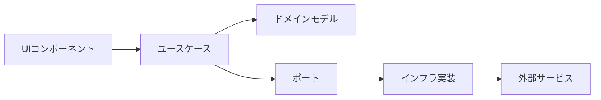

# 減価償却計算アプリ - 要件定義・技術選定書

アプリ名「にちわり！」

## 1. プロジェクト概要

### 1.1 目的

物を買うときに減価償却理論に基づいて、何年持つかから日割り換算して、本当に必要かどうか、買った方がお得か・自分が幸せになれるか判断できるWebアプリケーション

### 1.2 主要コンセプト

- **減価償却理論の日常応用**: 購入価格を使用期間で割って日割りコストを算出
- **科学的根拠に基づく購買判断**: 幸福度研究に基づいたチェックリスト
- **データドリブン**: トレンド分析と参考データの提供

## 2. 機能要件

### 2.1 コア機能

#### 2.1.1 減価償却計算機能

```yaml
入力:
  - 商品名（テキスト、最大100文字）
  - 価格（数値、0〜10億円）
  - 予想使用年数（数値、0.5〜100年、0.5年刻み）

処理:
  - 日割りコスト = 価格 ÷ (年数 × 365)
  - 月割りコスト = 日割りコスト × 30
  - 年割りコスト = 価格 ÷ 年数

出力:
  - 1日あたりのコスト（円）
  - 月額換算（円）
  - 年額換算（円）
  - 総使用日数
  - 比較指標（コーヒー代、ランチ代など）
```

#### 2.1.2 商品サジェスト機能

- 商品名入力時に参考データから候補を表示
- 選択すると平均価格と耐用年数を自動入力

#### 2.1.3 参考データベース

```yaml
カテゴリ:
  - 家電
  - ファッション
  - 家具
  - ガジェット
  - スポーツ
  - 趣味

データ構造:
  name: string # 商品名
  price: number # 平均価格
  years: number # 平均耐用年数
  category: string # カテゴリ
  icon: string # 表示アイコン
```

#### 2.1.4 幸福度診断機能

```yaml
チェックリスト項目:
  - 毎日または週に数回は使用する予定
  - 長期的に価値が持続する（流行に左右されない）
  - 生活の質や効率が明確に向上する
  - 同等の代替品やレンタルでは満足できない
  - 維持費が収入の5%以下である
  - 購入後1ヶ月経っても欲しいと思っている
  - 体験や思い出作りに寄与する
  - 健康や学習など自己投資になる

スコアリング:
  70%以上: 購入する価値が高い
  40-69%: もう少し検討が必要
  40%未満: 再考を推奨
```

#### 2.1.5 データ収集・トレンド機能

- 匿名で検索データを収集（商品名、価格帯、耐用年数）
- 人気商品ランキング表示（上位5-10件）
- よく調べられている商品の表示

### 2.2 科学的根拠Tips

```yaml
掲載する研究ベースのTips:
  - 経験vs物質: 経験への投資の方が長期的幸福度向上（Gilovich & Kumar, 2015）
  - 適応の法則: 高価な買い物の幸福感は3-6ヶ月で元に戻る（Kahneman & Deaton, 2010）
  - 時間を買う: 時間節約商品が最も効率的に幸福度向上（Whillans et al., 2017）
  - 比較の罠: 他人との比較での購入は満足度低下（Solnick & Hemenway, 1998）
  - 遅延満足: 30日ルールで衝動買いの70%を防止（Ariely & Wertenbroch, 2002）
  - 80/20ルール: 多機能製品の実使用機能は20%程度（Nielsen Norman Group, 2020）
```

## 3. 非機能要件

### 3.1 パフォーマンス要件

```yaml
初回ロード: 3秒以内
計算結果表示: 即座（< 100ms）
Lighthouse Score:
  Performance: 90以上
  Accessibility: 100
  Best Practices: 90以上
  SEO: 90以上
```

### 3.2 アクセシビリティ要件

```yaml
準拠基準: WCAG 2.1 Level AA
必須要件:
  - キーボードのみで全機能操作可能
  - スクリーンリーダー完全対応
  - 適切なARIAラベル
  - 十分なコントラスト比
  - フォーカス管理
  - エラーメッセージの明確な表示
```

### 3.3 対応環境

```yaml
ブラウザ:
  - Chrome/Edge: 最新2バージョン
  - Firefox: 最新2バージョン
  - Safari: 最新2バージョン

デバイス:
  - デスクトップ: 1024px以上
  - タブレット: 768px-1023px
  - モバイル: 767px以下
```

## 4. 技術スタック

### 4.1 フロントエンド

```yaml
フレームワーク:
  name: Nuxt 3
  version: 最新安定版
  mode: SSG（静的サイト生成）

言語:
  TypeScript:
    strict: true

UIライブラリ:
  name: Volt (PrimeVue + Tailwind)
  理由:
    - Code Ownershipモデルで完全制御可能
    - WCAG AA準拠のアクセシビリティ
    - PrimeVueの豊富なコンポーネント

CSS:
  name: Tailwind CSS v4
  config: CSS-firstアプローチ

状態管理:
  name: Pinia

バリデーション:
  name: Valibot
  理由:
    - 極小バンドルサイズ（Zodの10%）
    - TypeScript完全サポート
    - モジュラー設計
```

### 4.2 バックエンド・データ

```yaml
データベース:
  name: Supabase
  features:
    - PostgreSQL
    - リアルタイム同期
    - 匿名認証（データ収集用）

分析:
  - Supabase Analytics
  - カスタムイベントトラッキング
```

### 4.3 開発環境

```yaml
パッケージマネージャ: pnpm
Node.js: v20 LTS（Voltaで管理）

テスト:
  単体テスト: Vitest
  UIテスト: @testing-library/vue
  E2E: Playwright
  カバレッジ目標: 80%以上

コード品質:
  Linter: ESLint + @antfu/eslint-config
  Formatter: Prettier
  型チェック: TypeScript strict mode

Git:
  Hooks: Husky + lint-staged
  コミット規約: Conventional Commits

CI/CD:
  platform: GitHub Actions
  デプロイ: Vercel（無料枠）
```

## 5. アーキテクチャ設計

### 5.1 Clean Architecture + Feature Slicing

```
src/
├── core/                          # ビジネスロジック層
│   ├── domain/                    # ドメインモデル
│   │   ├── entities/
│   │   │   ├── Product.ts        # 商品エンティティ
│   │   │   ├── Calculation.ts    # 計算結果エンティティ
│   │   │   └── HappinessScore.ts # 幸福度スコアエンティティ
│   │   ├── valueObjects/
│   │   │   ├── Money.ts          # 金額値オブジェクト
│   │   │   ├── Years.ts          # 年数値オブジェクト
│   │   │   └── DailyCost.ts      # 日割りコスト値オブジェクト
│   │   └── types/
│   │       └── index.ts           # 共通型定義
│   │
│   ├── usecases/                  # ユースケース
│   │   ├── calculation/
│   │   │   ├── CalculateDailyCost.ts
│   │   │   └── CompareWithReference.ts
│   │   ├── happiness/
│   │   │   └── EvaluateHappinessScore.ts
│   │   └── analytics/
│   │       └── TrackProductSearch.ts
│   │
│   └── ports/                     # インターフェース定義
│       ├── ProductRepository.ts
│       ├── AnalyticsService.ts
│       └── TrendsRepository.ts
│
├── infrastructure/                 # 外部サービス層
│   ├── api/
│   │   └── supabase/
│   │       ├── client.ts          # Supabaseクライアント
│   │       └── types.ts           # Supabase型定義
│   ├── repositories/
│   │   ├── ProductRepositoryImpl.ts
│   │   └── TrendsRepositoryImpl.ts
│   └── services/
│       └── AnalyticsServiceImpl.ts
│
├── presentation/                   # プレゼンテーション層
│   ├── components/
│   │   ├── volt/                  # Voltコンポーネント（コピー＆カスタマイズ）
│   │   │   ├── VButton.vue
│   │   │   ├── VInput.vue
│   │   │   ├── VSelect.vue
│   │   │   └── VCheckbox.vue
│   │   ├── calculator/
│   │   │   ├── CalculatorForm.vue
│   │   │   └── ResultDisplay.vue
│   │   ├── reference/
│   │   │   ├── CategoryTabs.vue
│   │   │   └── ProductCard.vue
│   │   └── happiness/
│   │       ├── HappinessChecklist.vue
│   │       └── ScoreDisplay.vue
│   │
│   ├── composables/               # Vue Composables
│   │   ├── useCalculation.ts
│   │   ├── useValidation.ts      # Valibot統合
│   │   └── useAnalytics.ts
│   │
│   ├── pages/
│   │   └── index.vue              # メインページ
│   │
│   └── layouts/
│       └── default.vue            # デフォルトレイアウト
│
├── shared/                         # 共通機能
│   ├── utils/
│   │   ├── formatters.ts         # 数値・日付フォーマット
│   │   └── validators.ts         # Valibotスキーマ定義
│   ├── constants/
│   │   ├── categories.ts         # カテゴリ定数
│   │   └── referenceData.ts      # 参考データ
│   └── i18n/
│       ├── ja.json                # 日本語
│       └── en.json                # 英語
│
└── tests/                          # テスト
    ├── unit/                       # 単体テスト
    │   ├── core/
    │   └── shared/
    ├── integration/                # 統合テスト
    └── e2e/                       # E2Eテスト
        └── calculator.spec.ts
```

### 5.2 データフロー



## 6. 開発方針

### 6.1 TDD（テスト駆動開発）

#### 実践方法

```yaml
サイクル:
  1. Red: テストを書く（失敗）
  2. Green: 最小限の実装（成功）
  3. Refactor: リファクタリング

テスト戦略:
  - 仮実装から始める
  - 三角測量で一般化
  - 明白な実装は直接記述

命名規約:
  describe: "計算機能"のような機能名
  it: "〜する"という動作を記述

カバレッジ目標:
  単体テスト: 90%以上
  統合テスト: 70%以上
  E2E: クリティカルパスのみ
```

#### テスト例

```typescript
// core/usecases/calculation/CalculateDailyCost.spec.ts
describe('CalculateDailyCost', () => {
  describe('execute', () => {
    it('購入価格と使用年数から日割りコストを計算する', () => {
      // Arrange
      const useCase = new CalculateDailyCost()
      const input = {
        price: Money.of(150000),
        years: Years.of(5)
      }

      // Act
      const result = useCase.execute(input)

      // Assert
      expect(result.dailyCost.value).toBe(82)
      expect(result.monthlyCost.value).toBe(2460)
      expect(result.yearlyCost.value).toBe(30000)
    })

    it('0年の場合はエラーを返す', () => {
      // Arrange
      const useCase = new CalculateDailyCost()
      const input = {
        price: Money.of(150000),
        years: Years.of(0)
      }

      // Act & Assert
      expect(() => useCase.execute(input)).toThrow('使用年数は0より大きい値を入力してください')
    })
  })
})
```

### 6.2 バリデーション実装（Valibot）

```typescript
// shared/utils/validators.ts
import * as v from 'valibot'

// 商品入力スキーマ
export const ProductInputSchema = v.object({
  name: v.pipe(
    v.string(),
    v.minLength(1, '商品名を入力してください'),
    v.maxLength(100, '商品名は100文字以内で入力してください')
  ),
  price: v.pipe(
    v.number(),
    v.minValue(1, '価格は1円以上で入力してください'),
    v.maxValue(1000000000, '価格は10億円以下で入力してください')
  ),
  years: v.pipe(
    v.number(),
    v.minValue(0.5, '使用年数は0.5年以上で入力してください'),
    v.maxValue(100, '使用年数は100年以下で入力してください'),
    v.multipleOf(0.5, '使用年数は0.5年単位で入力してください')
  )
})

// 型推論
export type ProductInput = v.InferInput<typeof ProductInputSchema>
```

### 6.3 Voltコンポーネントのカスタマイズ

```vue
<!-- components/volt/VInput.vue -->
<script setup lang="ts">
import PrimeInputText from 'primevue/inputtext'
import { useId } from 'vue'

defineProps<{
  label?: string
  required?: boolean
  error?: string
  modelValue?: string | number
}>()

const inputId = useId()
const errorId = useId()
</script>

<template>
  <div class="v-input">
    <label
      v-if="label"
      :for="inputId"
      class="block text-sm font-medium text-gray-700 mb-1"
    >
      {{ label }}
      <span v-if="required" class="text-red-500 ml-1">*</span>
    </label>

    <PrimeInputText
      :id="inputId"
      v-model="modelValue"
      :unstyled="true"
      :invalid="!!error"
      :aria-describedby="errorId"
      :aria-invalid="!!error"
      :pt="{
        root: [
          'w-full px-3 py-2 border rounded-md',
          'focus:ring-2 focus:ring-blue-500 focus:border-blue-500',
          'transition-colors duration-200',
          error ? 'border-red-500' : 'border-gray-300',
        ].join(' '),
      }"
      v-bind="$attrs"
    />

    <p
      v-if="error"
      :id="errorId"
      class="mt-1 text-sm text-red-600"
      role="alert"
    >
      {{ error }}
    </p>
  </div>
</template>
```

## 7. 実装フェーズ

### Phase 1: 基盤構築（Week 1）

```yaml
タスク:
  - Nuxt 3プロジェクトセットアップ
  - Volt導入とカスタマイズ
  - TDD環境構築（Vitest設定）
  - クリーンアーキテクチャの基本構造作成
  - 基本的なドメインモデル実装（TDD）

成果物:
  - 動作する開発環境
  - 基本的なテストが通るドメインモデル
  - Voltコンポーネントのサンプル実装
```

### Phase 2: コア機能実装（Week 2-3）

```yaml
タスク:
  - 計算ロジック実装（TDD）
  - 計算フォームUI実装
  - 結果表示コンポーネント
  - バリデーション実装（Valibot）
  - 参考データの静的実装

成果物:
  - 計算機能が動作するアプリケーション
  - 単体テストカバレッジ80%以上
  - アクセシビリティ基準を満たすUI
```

### Phase 3: データ永続化（Week 4）

```yaml
タスク:
  - Supabase環境構築
  - データモデル設計・実装
  - リポジトリパターン実装
  - トレンド集計機能

成果物:
  - データ永続化機能
  - トレンドランキング表示
  - 匿名データ収集
```

### Phase 4: 拡張機能（Week 5）

```yaml
タスク:
  - 幸福度診断機能
  - 科学的根拠Tipsセクション
  - i18n対応（日英）
  - PWA対応

成果物:
  - 全機能実装完了
  - 多言語対応
  - オフライン対応
```

### Phase 5: 最適化・公開（Week 6）

```yaml
タスク:
  - パフォーマンス最適化
  - アクセシビリティ監査
  - E2Eテスト実装
  - デプロイ設定

成果物:
  - Lighthouse Score 90+
  - WCAG AA準拠確認
  - 本番環境デプロイ
```

## 8. エラーハンドリング

```typescript
// shared/utils/errors.ts
export class DomainError extends Error {
  constructor(message: string, public code: string) {
    super(message)
    this.name = 'DomainError'
  }
}

export class ValidationError extends DomainError {
  constructor(message: string, public field?: string) {
    super(message, 'VALIDATION_ERROR')
  }
}

export class CalculationError extends DomainError {
  constructor(message: string) {
    super(message, 'CALCULATION_ERROR')
  }
}

// グローバルエラーハンドラー
export function setupErrorHandling() {
  window.addEventListener('unhandledrejection', (event) => {
    console.error('Unhandled promise rejection:', event.reason)
    // Sentryに送信（本番環境）
  })
}
```

## 9. セキュリティ考慮事項

```yaml
XSS対策:
  - Vue3のデフォルトエスケープ機能を活用
  - v-htmlは使用禁止
  - ユーザー入力は必ずバリデーション

CSP設定:
  - Content-Security-Policy ヘッダー設定
  - インラインスクリプト禁止
  - 外部リソースはホワイトリスト制

データプライバシー:
  - 個人情報は収集しない
  - 匿名データのみ収集
  - GDPR/個人情報保護法準拠
```

## 10. デプロイ設定

```yaml
# vercel.json
buildCommand: pnpm run build
outputDirectory: .output/public
framework: nuxt
rewrites:
  - source: '/(.*)'
    destination: /index.html

headers:
  - source: '/(.*)'
    headers:
      - key: X-Content-Type-Options
        value: nosniff

      - key: X-Frame-Options
        value: SAMEORIGIN

      - key: X-XSS-Protection
        value: 1; mode=block
```

## 11. 参考データ（初期実装用）

```typescript
// shared/constants/referenceData.ts
export const REFERENCE_DATA = [
  // 家電
  { name: 'ノートパソコン', price: 150000, years: 5, category: '家電', icon: '💻' },
  { name: 'スマートフォン', price: 100000, years: 3, category: '家電', icon: '📱' },
  { name: '冷蔵庫', price: 200000, years: 15, category: '家電', icon: '🧊' },
  { name: '洗濯機', price: 100000, years: 10, category: '家電', icon: '🌀' },
  { name: 'エアコン', price: 150000, years: 13, category: '家電', icon: '❄️' },

  // ファッション
  { name: 'ビジネススーツ', price: 50000, years: 3, category: 'ファッション', icon: '👔' },
  { name: 'コート', price: 30000, years: 5, category: 'ファッション', icon: '🧥' },
  { name: 'スニーカー', price: 15000, years: 2, category: 'ファッション', icon: '👟' },

  // 他のカテゴリも同様に追加
]
```

## 12. 開発開始時のチェックリスト

```yaml
環境構築:
  ☐ Node.js v20 LTS インストール
  ☐ pnpm インストール
  ☐ Voltaセットアップ
  ☐ VSCode拡張機能インストール
    - Vue Language Features
    - TypeScript Vue Plugin
    - ESLint
    - Prettier
    - Vitest

プロジェクト初期化:
  ☐ Nuxt 3プロジェクト作成
  ☐ TypeScript strict mode設定
  ☐ Volt導入
  ☐ Tailwind CSS v4設定
  ☐ Valibot インストール
  ☐ Vitest設定
  ☐ ESLint/Prettier設定
  ☐ Husky/lint-staged設定

初回コミット:
  ☐ .gitignore設定
  ☐ README.md作成
  ☐ Conventional Commits設定
  ☐ 初回コミット（feat: initial setup）
```

## 13. オフライン対応戦略

### 13.1 機能別対応方針

```yaml
完全オフライン対応（Priority 1）:
  減価償却計算:
    - すべてクライアントサイドで実行
    - 外部API依存なし
    - ローカルストレージに履歴保存

  幸福度診断:
    - チェックリスト評価ロジックはクライアント実装
    - 結果の保存はローカルストレージ

  基本UI/UX:
    - 全画面遷移をオフライン対応
    - エラーメッセージ表示
    - オフライン通知バナー

オンライン時のみ（Priority 2）:
  データ収集:
    - 検索データの送信
    - 使用統計の記録

  トレンド機能:
    - リアルタイムランキング
    - 人気商品の表示

  アナリティクス:
    - ユーザー行動分析
    - エラートラッキング

ハイブリッド対応（Priority 3）:
  参考データベース:
    - 人気商品TOP30を事前バンドル
    - オンライン時に最新データ取得
    - キャッシュ有効期限: 7日間

  商品サジェスト:
    - オフライン: プリセットデータから提案
    - オンライン: リアルタイムサジェスト
```

### 13.2 Service Worker実装戦略

```javascript
// sw.js のキャッシュ戦略
const cacheStrategies = {
  // 静的アセット - Cache First
  '/assets/*': {
    strategy: 'CacheFirst',
    cacheName: 'static-assets-v1',
    expiration: 30 * 24 * 60 * 60 // 30日
  },

  // HTMLページ - Network First
  '/*.html': {
    strategy: 'NetworkFirst',
    cacheName: 'pages-v1',
    networkTimeout: 3000
  },

  // プリセットデータ - Cache First
  '/data/presets.json': {
    strategy: 'CacheFirst',
    cacheName: 'presets-v1',
    expiration: 7 * 24 * 60 * 60 // 7日
  },

  // API エンドポイント
  '/api/trends': {
    strategy: 'NetworkOnly' // オンラインのみ
  },
  '/api/analytics': {
    strategy: 'NetworkOnly' // オンラインのみ
  }
}
```

### 13.3 プリセットデータ設計

```typescript
// shared/constants/offlinePresets.ts
export const OFFLINE_PRESETS = {
  // 人気商品TOP30
  popular: [
    // ガジェット
    { name: 'iPhone 15 Pro', price: 159800, years: 3, category: 'ガジェット', icon: '📱' },
    { name: 'MacBook Air M3', price: 164800, years: 5, category: 'ガジェット', icon: '💻' },
    { name: 'iPad Pro 12.9', price: 172800, years: 4, category: 'ガジェット', icon: '📱' },
    { name: 'AirPods Pro', price: 39800, years: 3, category: 'ガジェット', icon: '🎧' },
    { name: 'Apple Watch Series 9', price: 59800, years: 3, category: 'ガジェット', icon: '⌚' },

    // 家電
    { name: 'ドラム式洗濯機', price: 250000, years: 10, category: '家電', icon: '🌀' },
    { name: '冷蔵庫（500L）', price: 200000, years: 15, category: '家電', icon: '🧊' },
    { name: 'エアコン（14畳用）', price: 150000, years: 13, category: '家電', icon: '❄️' },
    { name: 'ロボット掃除機', price: 80000, years: 5, category: '家電', icon: '🤖' },
    { name: '4K有機ELテレビ', price: 300000, years: 8, category: '家電', icon: '📺' },

    // ファッション
    { name: 'ビジネススーツ（オーダー）', price: 80000, years: 3, category: 'ファッション', icon: '👔' },
    { name: 'ブランドバッグ', price: 150000, years: 10, category: 'ファッション', icon: '👜' },
    { name: 'スニーカー（限定）', price: 30000, years: 2, category: 'ファッション', icon: '👟' },
    { name: 'ダウンジャケット', price: 50000, years: 5, category: 'ファッション', icon: '🧥' },
    { name: '腕時計（高級）', price: 500000, years: 20, category: 'ファッション', icon: '⌚' },

    // 家具
    { name: 'ワークチェア（高級）', price: 150000, years: 10, category: '家具', icon: '🪑' },
    { name: 'ダイニングテーブル', price: 100000, years: 15, category: '家具', icon: '🪑' },
    { name: 'ソファ（3人掛け）', price: 200000, years: 10, category: '家具', icon: '🛋️' },
    { name: 'ベッド（クイーン）', price: 150000, years: 15, category: '家具', icon: '🛏️' },
    { name: '収納棚（オーダー）', price: 80000, years: 20, category: '家具', icon: '📚' },

    // スポーツ
    { name: 'ロードバイク', price: 300000, years: 10, category: 'スポーツ', icon: '🚴' },
    { name: 'ゴルフクラブセット', price: 200000, years: 10, category: 'スポーツ', icon: '⛳' },
    { name: 'ランニングシューズ', price: 20000, years: 1, category: 'スポーツ', icon: '👟' },
    { name: 'スキー板セット', price: 150000, years: 8, category: 'スポーツ', icon: '⛷️' },
    { name: 'フィットネスバイク', price: 100000, years: 10, category: 'スポーツ', icon: '🚴' },

    // 趣味
    { name: 'デジタル一眼レフ', price: 300000, years: 7, category: '趣味', icon: '📷' },
    { name: 'ゲーミングPC', price: 250000, years: 4, category: '趣味', icon: '🎮' },
    { name: 'キャンプ用品セット', price: 100000, years: 10, category: '趣味', icon: '⛺' },
    { name: '電子ピアノ', price: 200000, years: 15, category: '趣味', icon: '🎹' },
    { name: '高級万年筆', price: 50000, years: 30, category: '趣味', icon: '✒️' }
  ],

  // カテゴリ別集計
  categoryStats: {
    家電: { count: 10, avgPrice: 192000, avgYears: 9.8 },
    ファッション: { count: 10, avgPrice: 102000, avgYears: 8.0 },
    家具: { count: 10, avgPrice: 136000, avgYears: 14.0 },
    ガジェット: { count: 10, avgPrice: 115400, avgYears: 3.6 },
    スポーツ: { count: 10, avgPrice: 154000, avgYears: 7.8 },
    趣味: { count: 10, avgPrice: 180000, avgYears: 14.2 }
  },

  // オフライン時のメッセージ
  offlineMessages: {
    trends: '現在オフラインのため、最新のトレンド情報は表示できません',
    suggestion: 'オフラインモードでは、よく検索される商品から提案しています',
    sync: 'オンラインになったら最新データに更新されます'
  }
}
```

### 13.4 オフライン通知UI

```vue
<!-- components/common/OfflineNotice.vue -->
<template>
  <Transition name="slide">
    <div
      v-if="isOffline"
      class="fixed top-0 left-0 right-0 bg-yellow-500 text-white px-4 py-2 z-50"
      role="alert"
      aria-live="polite"
    >
      <div class="container mx-auto flex items-center justify-between">
        <span class="flex items-center gap-2">
          <Icon name="wifi-off" />
          オフラインモードで動作中 - 一部機能が制限されています
        </span>
        <button
          class="text-white/80 hover:text-white"
          aria-label="通知を閉じる"
          @click="dismiss"
        >
          <Icon name="x" />
        </button>
      </div>
    </div>
  </Transition>
</template>
```

## 14. 法的・コンプライアンス要件

### 14.1 必須法的文書

```yaml
利用規約:
  記載事項:
    - サービスの概要と目的
    - 利用者の定義
    - 禁止事項
    - 免責事項（重要）
    - 知的財産権
    - 準拠法と管轄

  免責条項（必須）:
    - 本サービスの計算結果は参考値です
    - 購入判断は自己責任で行ってください
    - 計算結果による損害の責任は負いません

プライバシーポリシー:
  記載事項:
    - 収集する情報（匿名データのみ）
    - 情報の利用目的
    - 第三者提供の有無
    - Cookieの使用
    - 問い合わせ先

  GDPR対応:
    - データポータビリティ
    - 削除要求への対応
    - 同意の取得と記録

Cookie同意:
  実装要件:
    - 初回訪問時に表示
    - 必須/任意Cookie の区別
    - 同意の記録（localStorage）
    - 拒否可能な設計
```

### 14.2 法的文書テンプレート

```markdown
<!-- pages/terms.vue -->

# 利用規約

最終更新日: 2024年XX月XX日

## 1. はじめに

「にちわり！」（以下、「本サービス」）は、商品の減価償却計算を通じて
賢い購買判断を支援する無料のWebアプリケーションです。

## 2. 免責事項

**重要: 本サービスで提供される計算結果はすべて参考値です。**

- 実際の商品寿命は使用状況により大きく異なります
- 計算結果を基にした購買判断は自己責任で行ってください
- 本サービスの利用により生じた損害について一切責任を負いません

## 3. 知的財産権

本サービスのコンテンツ、ロゴ、デザインは当方に帰属します。

## 4. 準拠法

本規約は日本法に準拠し、紛争が生じた場合は東京地方裁判所を管轄とします。
```

## 15. 環境変数管理

### 15.1 環境変数設定

```bash
# .env.example
# Supabase設定
SUPABASE_URL=https://your-project.supabase.co
SUPABASE_ANON_KEY=your-anon-key
SUPABASE_SERVICE_KEY=your-service-key # ローカル開発のみ、本番では設定しない

# アナリティクス
GOOGLE_ANALYTICS_ID=G-XXXXXXXXXX
SENTRY_DSN=https://your-sentry-dsn@sentry.io/project-id

# 環境設定
NODE_ENV=development # development | production
APP_ENV=local # local | staging | production

# 機能フラグ
ENABLE_ANALYTICS=false # 開発環境ではfalse
ENABLE_PWA=true
ENABLE_OFFLINE_MODE=true

# API設定
API_TIMEOUT=5000
MAX_RETRY_COUNT=3
```

### 15.2 環境別設定ファイル

```typescript
// config/env.ts
export const config = {
  supabase: {
    url: process.env.SUPABASE_URL!,
    anonKey: process.env.SUPABASE_ANON_KEY!,
    // Service Keyは開発環境のみ
    serviceKey: process.env.NODE_ENV === 'development'
      ? process.env.SUPABASE_SERVICE_KEY
      : undefined
  },

  features: {
    analytics: process.env.ENABLE_ANALYTICS === 'true',
    pwa: process.env.ENABLE_PWA === 'true',
    offlineMode: process.env.ENABLE_OFFLINE_MODE === 'true'
  },

  api: {
    timeout: Number.parseInt(process.env.API_TIMEOUT || '5000'),
    maxRetry: Number.parseInt(process.env.MAX_RETRY_COUNT || '3')
  }
}
```

## 16. Supabase制限事項と対策

### 16.1 無料枠制限

```yaml
制限事項:
  APIリクエスト:
    制限: 500,000回/月
    対策:
      - クライアントサイドキャッシュ
      - バッチ処理の実装
      - 不要なAPIコールの削減

  データベース:
    容量: 500MB
    同時接続: 60
    対策:
      - 古いデータの定期削除
      - インデックス最適化
      - コネクションプーリング

  ストレージ:
    容量: 1GB
    帯域: 2GB/月
    対策:
      - 画像は外部CDN利用
      - ファイルサイズ制限

  認証:
    MAU: 50,000
    対策:
      - 匿名認証の活用
      - セッション管理の最適化
```

### 16.2 レート制限実装

```typescript
// utils/rateLimiter.ts
export class RateLimiter {
  private requests: Map<string, number[]> = new Map()

  constructor(
    private maxRequests: number = 10,
    private windowMs: number = 60000 // 1分
  ) {}

  async throttle(key: string): Promise<boolean> {
    const now = Date.now()
    const requests = this.requests.get(key) || []

    // 古いリクエストを削除
    const validRequests = requests.filter(
      time => now - time < this.windowMs
    )

    if (validRequests.length >= this.maxRequests) {
      return false // レート制限に達した
    }

    validRequests.push(now)
    this.requests.set(key, validRequests)
    return true
  }
}
```

### 16.3 モニタリング設定

```typescript
// services/monitoring.ts
export class SupabaseMonitor {
  private usageData = {
    apiCalls: 0,
    dbSize: 0,
    storageUsed: 0
  }

  async checkUsage() {
    // 使用量をチェック
    const usage = await this.getSupabaseUsage()

    // 閾値チェック（80%で警告）
    if (usage.apiCalls > 400000) {
      this.sendAlert('API使用量が80%を超えました')
    }

    if (usage.dbSize > 400) { // 400MB
      this.sendAlert('DB容量が80%を超えました')
    }
  }

  private sendAlert(message: string) {
    // Slackやメールで通知
    console.warn(`⚠️ Alert: ${message}`)
  }
}
```

## 17. 開発・運用体制

### 17.1 Git戦略

```yaml
ブランチ運用:
  main:
    - 本番環境と同期
    - 直接pushは禁止
    - タグでバージョン管理

  develop:
    - 開発環境と同期
    - feature branchのマージ先
    - 定期的にmainへマージ

  feature/*:
    - 機能開発用
    - developから作成
    - PR必須

  hotfix/*:
    - 緊急修正用
    - mainから作成
    - main/developへ即マージ

コミットメッセージ:
  - feat: 新機能
  - fix: バグ修正
  - docs: ドキュメント
  - style: コード整形
  - refactor: リファクタリング
  - test: テスト
  - chore: ビルド・ツール関連
```

### 17.2 CI/CDパイプライン

```yaml
# .github/workflows/ci.yml
name: CI/CD Pipeline

on:
  push:
    branches: [main, develop]
  pull_request:
    branches: [main, develop]

jobs:
  test:
    runs-on: ubuntu-latest
    steps:
      - uses: actions/checkout@v3
      - uses: volta-cli/action@v4
      - run: pnpm install
      - run: pnpm lint
      - run: pnpm test
      - run: pnpm build

  lighthouse:
    runs-on: ubuntu-latest
    steps:
      - uses: actions/checkout@v3
      - name: Lighthouse Check
        uses: treosh/lighthouse-ci-action@v10
        with:
          urls: |
            https://staging.nichiwari.app
          uploadArtifacts: true
          temporaryPublicStorage: true

  deploy-staging:
    if: github.ref == 'refs/heads/develop'
    needs: [test]
    runs-on: ubuntu-latest
    steps:
      - uses: actions/checkout@v3
      - uses: amondnet/vercel-action@v25
        with:
          vercel-token: ${{ secrets.VERCEL_TOKEN }}
          vercel-org-id: ${{ secrets.ORG_ID }}
          vercel-project-id: ${{ secrets.PROJECT_ID }}

  deploy-production:
    if: github.ref == 'refs/heads/main'
    needs: [test, lighthouse]
    runs-on: ubuntu-latest
    steps:
      - uses: actions/checkout@v3
      - uses: amondnet/vercel-action@v25
        with:
          vercel-token: ${{ secrets.VERCEL_TOKEN }}
          vercel-args: --prod
```

### 17.3 監視体制

```yaml
エラー監視（Sentry）:
  設定:
    - エラー自動収集
    - パフォーマンス計測
    - リリース追跡

  アラート:
    - エラー率 > 1%
    - 新規エラー発生
    - パフォーマンス劣化

死活監視:
  ツール: UptimeRobot（無料）
  設定:
    - 5分間隔でヘルスチェック
    - 3回連続失敗でアラート
    - Slack/メール通知

パフォーマンス監視:
  Vercel Analytics:
    - Core Web Vitals
    - リアルユーザーメトリクス

  カスタムメトリクス:
    - 計算実行時間
    - API応答時間
    - キャッシュヒット率
```

## 18. Storybook環境

### 18.1 セットアップ

```bash
# Storybook導入
pnpm add -D @storybook/vue3 @storybook/addon-essentials
```

### 18.2 Voltコンポーネントカタログ

```typescript
// components/volt/VButton.stories.ts
import type { Meta, StoryObj } from '@storybook/vue3'
import VButton from './VButton.vue'

const meta = {
  title: 'Volt/Button',
  component: VButton,
  argTypes: {
    variant: {
      control: 'select',
      options: ['primary', 'secondary', 'danger', 'ghost']
    },
    size: {
      control: 'select',
      options: ['sm', 'md', 'lg']
    }
  }
} satisfies Meta<typeof VButton>

export default meta
type Story = StoryObj<typeof meta>

export const Primary: Story = {
  args: {
    label: '計算する',
    variant: 'primary'
  }
}

export const Loading: Story = {
  args: {
    label: '計算中...',
    loading: true
  }
}
```

### 18.3 デザインシステムドキュメント

```markdown
# デザインシステムガイド

## カラーパレット

- Primary: #3B82F6 (青)
- Secondary: #10B981 (緑)
- Danger: #EF4444 (赤)
- Warning: #F59E0B (黄)

## タイポグラフィ

- 見出し: Noto Sans JP Bold
- 本文: Noto Sans JP Regular
- 数値: Tabular nums

## スペーシング

- xs: 4px
- sm: 8px
- md: 16px
- lg: 24px
- xl: 32px
```

## 19. SEOとマーケティング

### 19.1 SEO対策

```yaml
技術的SEO:
  - OGPタグ設定
  - 構造化データ（JSON-LD）
  - sitemap.xml自動生成
  - robots.txt最適化
  - canonical URL設定

コンテンツSEO:
  - タイトル最適化
  - メタディスクリプション
  - h1-h6の適切な使用
  - 画像のalt属性

パフォーマンスSEO:
  - Core Web Vitals最適化
  - 画像の遅延読み込み
  - CDN活用
```

### 19.2 ソーシャル対応

```vue
<!-- nuxt.config.ts -->
export default defineNuxtConfig({
  app: {
    head: {
      meta: [
        { property: 'og:title', content: 'にちわり！ - 賢い買い物の味方' },
        { property: 'og:description', content: '減価償却計算で購入判断をサポート' },
        { property: 'og:image', content: '/og-image.png' },
        { property: 'twitter:card', content: 'summary_large_image' }
      ]
    }
  }
})
```

## 20. リスク管理計画

### 20.1 想定リスクと対策

```yaml
技術的リスク:
  Supabase障害:
    影響: データ保存・取得不可
    対策: オフラインモードへ自動切替

  Vercelダウン:
    影響: サービス停止
    対策:
      - Netlifyへのフェイルオーバー準備
      - 静的サイト生成でCDN配信

ビジネスリスク:
  利用者急増:
    影響: API制限超過
    対策:
      - 段階的な機能制限
      - 有料プランへの移行準備

  法的問題:
    影響: サービス停止命令
    対策:
      - 利用規約の整備
      - 法務相談体制
```

### 20.2 インシデント対応

```yaml
対応フロー:
  1. 検知:
    - 監視アラート
    - ユーザー報告

  2. 評価:
    - 影響範囲確認
    - 優先度判定

  3. 対応:
    - 緊急修正
    - ユーザー通知

  4. 事後対応:
    - 原因分析
    - 再発防止策
```

## 21. E2Eテスト戦略（Playwright）

### 21.1 Playwright設定

```typescript
// playwright.config.ts
import { defineConfig, devices } from '@playwright/test'

export default defineConfig({
  testDir: './tests/e2e',
  fullyParallel: true,
  forbidOnly: !!process.env.CI,
  retries: process.env.CI ? 2 : 0,
  workers: process.env.CI ? 1 : undefined,
  reporter: [
    ['html'],
    ['json', { outputFile: 'test-results.json' }],
    ['junit', { outputFile: 'junit.xml' }]
  ],

  use: {
    baseURL: 'http://localhost:3000',
    trace: 'on-first-retry',
    screenshot: 'only-on-failure',
    video: 'retain-on-failure',

    // テストの共通設定
    actionTimeout: 10000,
    navigationTimeout: 30000,

    // ビューポート設定
    viewport: { width: 1280, height: 720 },

    // ローカルストレージの初期設定
    storageState: {
      cookies: [],
      origins: [{
        origin: 'http://localhost:3000',
        localStorage: [{
          name: 'cookieConsent',
          value: 'true'
        }]
      }]
    }
  },

  // テストするブラウザ/デバイス
  projects: [
    {
      name: 'chromium',
      use: { ...devices['Desktop Chrome'] }
    },
    {
      name: 'firefox',
      use: { ...devices['Desktop Firefox'] }
    },
    {
      name: 'webkit',
      use: { ...devices['Desktop Safari'] }
    },
    {
      name: 'mobile-chrome',
      use: { ...devices['Pixel 5'] }
    },
    {
      name: 'mobile-safari',
      use: { ...devices['iPhone 13'] }
    }
  ],

  // 開発サーバー設定
  webServer: {
    command: 'pnpm dev',
    url: 'http://localhost:3000',
    reuseExistingServer: !process.env.CI,
    timeout: 120000
  }
})
```

### 21.2 Page Object Model (POM)

```typescript
// tests/e2e/pages/CalculatorPage.ts
import { Locator, Page } from '@playwright/test'

export class CalculatorPage {
  readonly page: Page
  readonly productNameInput: Locator
  readonly priceInput: Locator
  readonly yearsInput: Locator
  readonly calculateButton: Locator
  readonly dailyCostResult: Locator
  readonly monthlyCostResult: Locator
  readonly yearlyCostResult: Locator
  readonly errorMessage: Locator

  constructor(page: Page) {
    this.page = page
    this.productNameInput = page.getByLabel('商品名')
    this.priceInput = page.getByLabel('価格')
    this.yearsInput = page.getByLabel('使用年数')
    this.calculateButton = page.getByRole('button', { name: '計算する' })
    this.dailyCostResult = page.getByTestId('daily-cost')
    this.monthlyCostResult = page.getByTestId('monthly-cost')
    this.yearlyCostResult = page.getByTestId('yearly-cost')
    this.errorMessage = page.getByRole('alert')
  }

  async goto() {
    await this.page.goto('/')
  }

  async calculate(productName: string, price: number, years: number) {
    await this.productNameInput.fill(productName)
    await this.priceInput.fill(price.toString())
    await this.yearsInput.fill(years.toString())
    await this.calculateButton.click()
  }

  async waitForResults() {
    await this.dailyCostResult.waitFor({ state: 'visible' })
  }

  async getDailyCost(): Promise<string> {
    return await this.dailyCostResult.textContent() || ''
  }

  async getErrorMessage(): Promise<string> {
    return await this.errorMessage.textContent() || ''
  }
}
```

### 21.3 テストシナリオ

```typescript
// tests/e2e/calculator.spec.ts
import { expect, test } from '@playwright/test'
import { CalculatorPage } from './pages/CalculatorPage'

test.describe('減価償却計算機能', () => {
  test.beforeEach(async ({ page }) => {
    const calculator = new CalculatorPage(page)
    await calculator.goto()
  })

  test('正常な計算ができる', async ({ page }) => {
    const calculator = new CalculatorPage(page)

    // 計算実行
    await calculator.calculate('iPhone 15', 150000, 3)
    await calculator.waitForResults()

    // 結果検証
    const dailyCost = await calculator.getDailyCost()
    expect(dailyCost).toContain('137円') // 150000 / (3 * 365) = 約137円
  })

  test('バリデーションエラーが表示される', async ({ page }) => {
    const calculator = new CalculatorPage(page)

    // 価格に0を入力
    await calculator.calculate('テスト商品', 0, 5)

    // エラーメッセージ確認
    const error = await calculator.getErrorMessage()
    expect(error).toContain('価格は1円以上で入力してください')
  })

  test('商品サジェストが動作する', async ({ page }) => {
    const calculator = new CalculatorPage(page)

    // 商品名入力開始
    await calculator.productNameInput.fill('iPhone')

    // サジェスト表示を待つ
    const suggestion = page.getByRole('option', { name: /iPhone 15/ })
    await expect(suggestion).toBeVisible()

    // サジェスト選択
    await suggestion.click()

    // 自動入力確認
    await expect(calculator.priceInput).toHaveValue('159800')
    await expect(calculator.yearsInput).toHaveValue('3')
  })

  test('オフラインモードでも計算できる', async ({ page, context }) => {
    const calculator = new CalculatorPage(page)

    // オフライン状態をシミュレート
    await context.setOffline(true)

    // 計算実行
    await calculator.calculate('テスト商品', 100000, 5)
    await calculator.waitForResults()

    // 結果確認（オフラインでも動作）
    const dailyCost = await calculator.getDailyCost()
    expect(dailyCost).toContain('55円')

    // オフライン通知確認
    const offlineNotice = page.getByText('オフラインモードで動作中')
    await expect(offlineNotice).toBeVisible()
  })
})

test.describe('幸福度診断機能', () => {
  test('チェックリストで診断できる', async ({ page }) => {
    await page.goto('/happiness')

    // チェック項目を選択
    await page.getByLabel('毎日または週に数回は使用する予定').check()
    await page.getByLabel('生活の質や効率が明確に向上する').check()
    await page.getByLabel('体験や思い出作りに寄与する').check()

    // 診断実行
    await page.getByRole('button', { name: '診断する' }).click()

    // 結果確認
    const score = page.getByTestId('happiness-score')
    await expect(score).toContainText('37.5%')
    const advice = page.getByTestId('happiness-advice')
    await expect(advice).toContainText('もう少し検討が必要')
  })
})
```

### 21.4 アクセシビリティテスト

```typescript
import AxeBuilder from '@axe-core/playwright'
// tests/e2e/a11y.spec.ts
import { expect, test } from '@playwright/test'

test.describe('アクセシビリティテスト', () => {
  test('トップページがWCAG AA準拠', async ({ page }) => {
    await page.goto('/')

    const accessibilityScanResults = await new AxeBuilder({ page })
      .withTags(['wcag2aa'])
      .analyze()

    expect(accessibilityScanResults.violations).toEqual([])
  })

  test('キーボードナビゲーションが可能', async ({ page }) => {
    await page.goto('/')

    // Tabキーでフォーカス移動
    await page.keyboard.press('Tab')
    await expect(page.locator(':focus')).toHaveAttribute('aria-label', '商品名')

    await page.keyboard.press('Tab')
    await expect(page.locator(':focus')).toHaveAttribute('aria-label', '価格')

    await page.keyboard.press('Tab')
    await expect(page.locator(':focus')).toHaveAttribute('aria-label', '使用年数')

    await page.keyboard.press('Tab')
    await expect(page.locator(':focus')).toHaveText('計算する')

    // Enterキーで実行
    await page.keyboard.press('Enter')
  })

  test('スクリーンリーダー用の要素が適切', async ({ page }) => {
    await page.goto('/')

    // aria-liveリージョン確認
    const liveRegion = page.locator('[aria-live]')
    await expect(liveRegion).toHaveAttribute('aria-live', 'polite')

    // aria-label確認
    const inputs = page.locator('input')
    const count = await inputs.count()
    for (let i = 0; i < count; i++) {
      const input = inputs.nth(i)
      const label = await input.getAttribute('aria-label')
        || await input.getAttribute('aria-labelledby')
      expect(label).toBeTruthy()
    }
  })
})
```

### 21.5 ビジュアルリグレッションテスト

```typescript
// tests/e2e/visual.spec.ts
import { expect, test } from '@playwright/test'

test.describe('ビジュアルリグレッションテスト', () => {
  test('トップページのスクリーンショット', async ({ page }) => {
    await page.goto('/')
    await expect(page).toHaveScreenshot('homepage.png', {
      fullPage: true,
      animations: 'disabled'
    })
  })

  test('計算結果表示のスクリーンショット', async ({ page }) => {
    await page.goto('/')

    // 計算実行
    await page.getByLabel('商品名').fill('テスト商品')
    await page.getByLabel('価格').fill('100000')
    await page.getByLabel('使用年数').fill('5')
    await page.getByRole('button', { name: '計算する' }).click()

    // 結果表示を待つ
    await page.getByTestId('daily-cost').waitFor()

    // スクリーンショット比較
    await expect(page.locator('.result-section')).toHaveScreenshot('result.png')
  })

  test('モバイル表示のスクリーンショット', async ({ page }) => {
    await page.setViewportSize({ width: 375, height: 667 })
    await page.goto('/')
    await expect(page).toHaveScreenshot('mobile-homepage.png', {
      fullPage: true
    })
  })
})
```

### 21.6 パフォーマンステスト

```typescript
// tests/e2e/performance.spec.ts
import { expect, test } from '@playwright/test'

test.describe('パフォーマンステスト', () => {
  test('初回ロード時間が3秒以内', async ({ page }) => {
    const startTime = Date.now()
    await page.goto('/')
    await page.waitForLoadState('networkidle')
    const loadTime = Date.now() - startTime

    expect(loadTime).toBeLessThan(3000)
  })

  test('計算実行が100ms以内', async ({ page }) => {
    await page.goto('/')

    // 入力
    await page.getByLabel('商品名').fill('テスト')
    await page.getByLabel('価格').fill('100000')
    await page.getByLabel('使用年数').fill('5')

    // 計算時間計測
    const startTime = Date.now()
    await page.getByRole('button', { name: '計算する' }).click()
    await page.getByTestId('daily-cost').waitFor()
    const calcTime = Date.now() - startTime

    expect(calcTime).toBeLessThan(100)
  })

  test('Core Web Vitalsの測定', async ({ page }) => {
    await page.goto('/')

    // LCP測定
    const lcp = await page.evaluate(() => {
      return new Promise((resolve) => {
        new PerformanceObserver((list) => {
          const entries = list.getEntries()
          const lastEntry = entries[entries.length - 1]
          resolve(lastEntry.startTime)
        }).observe({ type: 'largest-contentful-paint', buffered: true })
      })
    })

    expect(lcp).toBeLessThan(2500) // 2.5秒以内
  })
})
```

### 21.7 テストデータ管理

```typescript
// tests/e2e/fixtures/testData.ts
export const testProducts = {
  valid: [
    { name: 'iPhone 15', price: 150000, years: 3, expectedDaily: 137 },
    { name: 'MacBook Pro', price: 300000, years: 5, expectedDaily: 164 },
    { name: '冷蔵庫', price: 200000, years: 15, expectedDaily: 37 }
  ],
  invalid: [
    { name: '', price: 100000, years: 5, error: '商品名を入力してください' },
    { name: 'テスト', price: 0, years: 5, error: '価格は1円以上で入力してください' },
    { name: 'テスト', price: 100000, years: 0, error: '使用年数は0.5年以上で入力してください' }
  ],
  edge: [
    { name: 'A'.repeat(100), price: 1, years: 0.5 }, // 最小値
    { name: 'テスト', price: 1000000000, years: 100 } // 最大値
  ]
}

// tests/e2e/fixtures/users.ts
export const testUsers = {
  default: {
    preferences: {
      darkMode: false,
      locale: 'ja'
    }
  },
  returning: {
    history: [
      { name: 'iPhone 14', price: 120000, years: 3 }
    ],
    preferences: {
      darkMode: true,
      locale: 'ja'
    }
  }
}
```

### 21.8 CI/CDでのE2E実行

```yaml
# .github/workflows/e2e.yml
name: E2E Tests

on:
  push:
    branches: [main, develop]
  pull_request:
    branches: [main, develop]

jobs:
  e2e:
    runs-on: ubuntu-latest
    container:
      image: mcr.microsoft.com/playwright:v1.40.0-focal

    steps:
      - uses: actions/checkout@v3

      - name: Setup Node
        uses: actions/setup-node@v3
        with:
          node-version: 20

      - name: Install pnpm
        run: npm install -g pnpm

      - name: Install dependencies
        run: pnpm install

      - name: Build application
        run: pnpm build

      - name: Run E2E tests
        run: pnpm test:e2e

      - name: Upload test results
        if: always()
        uses: actions/upload-artifact@v3
        with:
          name: playwright-report
          path: playwright-report/
          retention-days: 30

      - name: Upload screenshots
        if: failure()
        uses: actions/upload-artifact@v3
        with:
          name: screenshots
          path: test-results/
```

### 21.9 ローカル実行コマンド

```json
// package.json scripts
{
  "scripts": {
    "test:e2e": "playwright test",
    "test:e2e:headed": "playwright test --headed",
    "test:e2e:debug": "playwright test --debug",
    "test:e2e:ui": "playwright test --ui",
    "test:e2e:chrome": "playwright test --project=chromium",
    "test:e2e:mobile": "playwright test --project=mobile-*",
    "test:e2e:a11y": "playwright test a11y.spec.ts",
    "test:e2e:visual": "playwright test visual.spec.ts",
    "test:e2e:update-snapshots": "playwright test --update-snapshots",
    "test:e2e:report": "playwright show-report"
  }
}
```

### 21.10 E2Eテストカバレッジ目標

```yaml
カバレッジ目標:
  クリティカルパス: 100% # 計算機能、結果表示
  主要機能: 80% # 幸福度診断、商品サジェスト
  エッジケース: 60% # 境界値、エラーケース

  デバイス:
    - デスクトップ: Chrome, Firefox, Safari
    - モバイル: iOS Safari, Android Chrome

  アクセシビリティ:
    - WCAG AA準拠: 100%
    - キーボードナビゲーション: 100%
    - スクリーンリーダー: 主要フロー

実行頻度:
  ローカル開発: プッシュ前に主要テスト
  PR作成時: フルテスト実行
  本番デプロイ前: フルテスト + ビジュアルテスト
```

## 注意事項

1. **Voltコンポーネントは直接編集可能** - node_modulesではなくプロジェクト内にコピーして使用
2. **TDD厳守** - 実装前に必ずテストを書く
3. **アクセシビリティファースト** - すべてのUIコンポーネントでWCAG AA準拠を確認
4. **パフォーマンス計測** - 各フェーズ終了時にLighthouse実行
5. **コミット粒度** - 機能単位でコミット、Conventional Commits準拠
6. **オフライン対応** - 計算機能は必ず動作保証
7. **法的文書** - リリース前に必ず準備
8. **E2Eテスト** - クリティカルパスは必ずカバー

---

このドキュメントに基づいて実装を進めてください。不明な点があれば質問してください。
