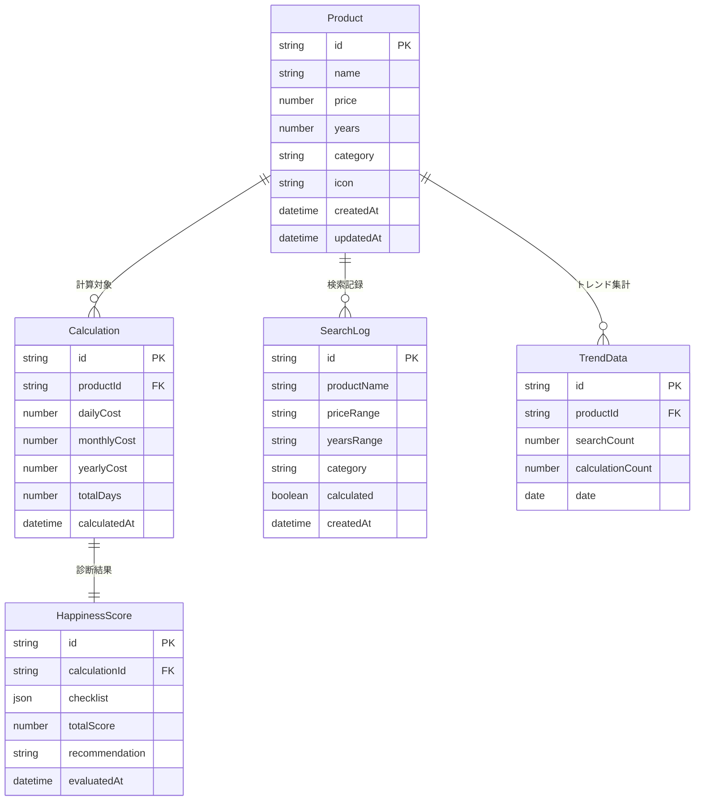

# データモデル設計

## 1. ドメインモデル設計

### 1.1 エンティティ関連図



## 2. ドメインエンティティ

### 2.1 Product（商品）

```typescript
// src/core/domain/entities/Product.ts
export class Product {
  private readonly _id: ProductId;
  private readonly _name: ProductName;
  private readonly _price: Money;
  private readonly _years: Years;
  private readonly _category: Category;
  private readonly _icon: Icon;

  constructor(props: {
    id: string;
    name: string;
    price: number;
    years: number;
    category?: string;
    icon?: string;
  }) {
    this._id = new ProductId(props.id);
    this._name = new ProductName(props.name);
    this._price = Money.of(props.price);
    this._years = Years.of(props.years);
    this._category = new Category(props.category || 'その他');
    this._icon = new Icon(props.icon || '📦');
  }

  // ビジネスロジック
  calculateDailyCost(): DailyCost {
    const totalDays = this._years.toDays();
    return new DailyCost(this._price.value / totalDays);
  }

  calculateMonthlyCost(): MonthlyCost {
    const dailyCost = this.calculateDailyCost();
    return dailyCost.toMonthly();
  }

  calculateYearlyCost(): YearlyCost {
    return new YearlyCost(this._price.value / this._years.value);
  }

  // 比較メトリクス
  getComparisonMetrics(): ComparisonMetrics {
    const dailyCost = this.calculateDailyCost();
    return {
      coffeeCount: Math.floor(dailyCost.value / 200),
      lunchCount: Math.floor(dailyCost.value / 500),
      subscriptionCount: Math.floor(this.calculateMonthlyCost().value / 1000)
    };
  }

  // ゲッター
  get id(): string { return this._id.value; }
  get name(): string { return this._name.value; }
  get price(): number { return this._price.value; }
  get years(): number { return this._years.value; }
  get category(): string { return this._category.value; }
  get icon(): string { return this._icon.value; }
}
```

### 2.2 Calculation（計算結果）

```typescript
// src/core/domain/entities/Calculation.ts
export class Calculation {
  private readonly _id: CalculationId;
  private readonly _product: Product;
  private readonly _dailyCost: DailyCost;
  private readonly _monthlyCost: MonthlyCost;
  private readonly _yearlyCost: YearlyCost;
  private readonly _totalDays: number;
  private readonly _calculatedAt: Date;

  constructor(product: Product) {
    this._id = CalculationId.generate();
    this._product = product;
    this._dailyCost = product.calculateDailyCost();
    this._monthlyCost = product.calculateMonthlyCost();
    this._yearlyCost = product.calculateYearlyCost();
    this._totalDays = Years.of(product.years).toDays();
    this._calculatedAt = new Date();
  }

  // 結果の取得
  getResult(): CalculationResult {
    return {
      id: this._id.value,
      productName: this._product.name,
      price: this._product.price,
      years: this._product.years,
      dailyCost: this._dailyCost.value,
      monthlyCost: this._monthlyCost.value,
      yearlyCost: this._yearlyCost.value,
      totalDays: this._totalDays,
      comparisonMetrics: this._product.getComparisonMetrics(),
      calculatedAt: this._calculatedAt
    };
  }

  // 履歴用のサマリー
  toHistoryEntry(): HistoryEntry {
    return {
      id: this._id.value,
      productName: this._product.name,
      dailyCost: this._dailyCost.formatted(),
      calculatedAt: this._calculatedAt
    };
  }
}
```

### 2.3 HappinessScore（幸福度スコア）

```typescript
// src/core/domain/entities/HappinessScore.ts
export class HappinessScore {
  private readonly _id: HappinessScoreId;
  private readonly _checklist: ChecklistAnswers;
  private readonly _totalScore: Score;
  private readonly _categoryScores: CategoryScores;
  private readonly _recommendation: Recommendation;
  private readonly _evaluatedAt: Date;

  constructor(answers: Map<string, boolean>) {
    this._id = HappinessScoreId.generate();
    this._checklist = new ChecklistAnswers(answers);
    this._totalScore = this.calculateTotalScore();
    this._categoryScores = this.calculateCategoryScores();
    this._recommendation = this.determineRecommendation();
    this._evaluatedAt = new Date();
  }

  private calculateTotalScore(): Score {
    const items = HappinessChecklistItems.getAll();
    let weightedScore = 0;
    let maxScore = 0;

    items.forEach(item => {
      maxScore += item.weight;
      if (this._checklist.isChecked(item.id)) {
        weightedScore += item.weight;
      }
    });

    const percentage = (weightedScore / maxScore) * 100;
    return new Score(percentage);
  }

  private calculateCategoryScores(): CategoryScores {
    const categories = ['frequency', 'value', 'financial', 'emotional'];
    const scores = new Map<string, number>();

    categories.forEach(category => {
      const categoryItems = HappinessChecklistItems.getByCategory(category);
      let categoryScore = 0;
      let categoryMax = 0;

      categoryItems.forEach(item => {
        categoryMax += item.weight;
        if (this._checklist.isChecked(item.id)) {
          categoryScore += item.weight;
        }
      });

      scores.set(category, (categoryScore / categoryMax) * 100);
    });

    return new CategoryScores(scores);
  }

  private determineRecommendation(): Recommendation {
    const score = this._totalScore.value;

    if (score >= 70) {
      return new Recommendation(
        'highly-recommended',
        '購入する価値が高いです！長期的な満足度が期待できます。'
      );
    } else if (score >= 40) {
      return new Recommendation(
        'consider-more',
        `もう少し検討が必要かもしれません。特に${this.getWeakestCategory()}の観点を再考してみてください。`
      );
    } else {
      return new Recommendation(
        'reconsider',
        '再考をお勧めします。レンタルや代替品も検討してみてください。'
      );
    }
  }

  private getWeakestCategory(): string {
    return this._categoryScores.getWeakest();
  }

  // 結果の取得
  getEvaluation(): EvaluationResult {
    return {
      id: this._id.value,
      totalScore: this._totalScore.value,
      categoryScores: this._categoryScores.toObject(),
      recommendation: this._recommendation.level,
      advice: this._recommendation.message,
      checkedItems: this._checklist.getCheckedItems(),
      evaluatedAt: this._evaluatedAt
    };
  }
}
```

## 3. 値オブジェクト

### 3.1 Money（金額）

```typescript
// src/core/domain/valueObjects/Money.ts
export class Money {
  private constructor(
    private readonly _value: number
  ) {
    this.validate();
  }

  private validate(): void {
    if (this._value < 0) {
      throw new ValidationError('金額は0以上である必要があります');
    }
    if (this._value > 1000000000) {
      throw new ValidationError('金額は10億円以下である必要があります');
    }
    if (!Number.isInteger(this._value)) {
      throw new ValidationError('金額は整数である必要があります');
    }
  }

  static of(value: number): Money {
    return new Money(Math.floor(value));
  }

  get value(): number {
    return this._value;
  }

  // 演算
  add(other: Money): Money {
    return Money.of(this._value + other._value);
  }

  subtract(other: Money): Money {
    return Money.of(this._value - other._value);
  }

  multiply(factor: number): Money {
    return Money.of(this._value * factor);
  }

  divideByDays(days: number): number {
    return Math.round(this._value / days);
  }

  // フォーマット
  formatted(): string {
    return new Intl.NumberFormat('ja-JP', {
      style: 'currency',
      currency: 'JPY'
    }).format(this._value);
  }

  equals(other: Money): boolean {
    return this._value === other._value;
  }
}
```

### 3.2 Years（使用年数）

```typescript
// src/core/domain/valueObjects/Years.ts
export class Years {
  private constructor(
    private readonly _value: number
  ) {
    this.validate();
  }

  private validate(): void {
    if (this._value < 0.5) {
      throw new ValidationError('使用年数は0.5年以上である必要があります');
    }
    if (this._value > 100) {
      throw new ValidationError('使用年数は100年以下である必要があります');
    }
    if (this._value % 0.5 !== 0) {
      throw new ValidationError('使用年数は0.5年単位である必要があります');
    }
  }

  static of(value: number): Years {
    // 0.5単位に丸める
    const rounded = Math.round(value * 2) / 2;
    return new Years(rounded);
  }

  get value(): number {
    return this._value;
  }

  toDays(): number {
    return Math.floor(this._value * 365);
  }

  toMonths(): number {
    return Math.floor(this._value * 12);
  }

  formatted(): string {
    return `${this._value}年`;
  }

  equals(other: Years): boolean {
    return this._value === other._value;
  }
}
```

### 3.3 DailyCost（日割りコスト）

```typescript
// src/core/domain/valueObjects/DailyCost.ts
export class DailyCost {
  constructor(
    private readonly _value: number
  ) {
    this.validate();
  }

  private validate(): void {
    if (this._value < 0) {
      throw new ValidationError('日割りコストは0以上である必要があります');
    }
  }

  get value(): number {
    return Math.round(this._value);
  }

  toMonthly(): MonthlyCost {
    return new MonthlyCost(this._value * 30);
  }

  toYearly(): YearlyCost {
    return new YearlyCost(this._value * 365);
  }

  // 比較用メソッド
  isLessThan(amount: number): boolean {
    return this._value < amount;
  }

  isMoreThan(amount: number): boolean {
    return this._value > amount;
  }

  // 参考指標への変換
  toCoffeeCount(): number {
    return Math.floor(this._value / 200);
  }

  toLunchCount(): number {
    return Math.floor(this._value / 500);
  }

  formatted(): string {
    return `${Math.round(this._value)}円/日`;
  }
}
```

## 4. データベーススキーマ

### 4.1 Supabaseテーブル定義

```sql
-- 商品マスタテーブル
CREATE TABLE products (
  id UUID DEFAULT gen_random_uuid() PRIMARY KEY,
  name VARCHAR(100) NOT NULL,
  price INTEGER NOT NULL CHECK (price > 0 AND price <= 1000000000),
  years DECIMAL(4,1) NOT NULL CHECK (years >= 0.5 AND years <= 100),
  category VARCHAR(50) DEFAULT 'その他',
  icon VARCHAR(10) DEFAULT '📦',
  popularity_score INTEGER DEFAULT 0,
  created_at TIMESTAMP WITH TIME ZONE DEFAULT NOW(),
  updated_at TIMESTAMP WITH TIME ZONE DEFAULT NOW()
);

-- インデックス
CREATE INDEX idx_products_name ON products(name);
CREATE INDEX idx_products_category ON products(category);
CREATE INDEX idx_products_popularity ON products(popularity_score DESC);

-- 検索ログテーブル（匿名）
CREATE TABLE search_logs (
  id UUID DEFAULT gen_random_uuid() PRIMARY KEY,
  product_name VARCHAR(100),
  price_range VARCHAR(50),
  years_range VARCHAR(50),
  category VARCHAR(50),
  calculated BOOLEAN DEFAULT false,
  session_id VARCHAR(100), -- 匿名セッションID
  created_at TIMESTAMP WITH TIME ZONE DEFAULT NOW()
);

-- インデックス
CREATE INDEX idx_search_logs_created ON search_logs(created_at DESC);
CREATE INDEX idx_search_logs_product ON search_logs(product_name);

-- 計算履歴テーブル（ローカルストレージのバックアップ用）
CREATE TABLE calculation_history (
  id UUID DEFAULT gen_random_uuid() PRIMARY KEY,
  session_id VARCHAR(100) NOT NULL,
  product_name VARCHAR(100) NOT NULL,
  price INTEGER NOT NULL,
  years DECIMAL(4,1) NOT NULL,
  daily_cost INTEGER NOT NULL,
  monthly_cost INTEGER NOT NULL,
  yearly_cost INTEGER NOT NULL,
  total_days INTEGER NOT NULL,
  calculated_at TIMESTAMP WITH TIME ZONE DEFAULT NOW()
);

-- トレンドデータテーブル
CREATE TABLE trend_data (
  id UUID DEFAULT gen_random_uuid() PRIMARY KEY,
  product_id UUID REFERENCES products(id),
  product_name VARCHAR(100),
  search_count INTEGER DEFAULT 0,
  calculation_count INTEGER DEFAULT 0,
  date DATE NOT NULL,
  created_at TIMESTAMP WITH TIME ZONE DEFAULT NOW(),
  UNIQUE(product_id, date)
);

-- インデックス
CREATE INDEX idx_trend_data_date ON trend_data(date DESC);
CREATE INDEX idx_trend_data_search ON trend_data(search_count DESC);
```

### 4.2 RLS（Row Level Security）設定

```sql
-- RLS有効化
ALTER TABLE products ENABLE ROW LEVEL SECURITY;
ALTER TABLE search_logs ENABLE ROW LEVEL SECURITY;
ALTER TABLE calculation_history ENABLE ROW LEVEL SECURITY;
ALTER TABLE trend_data ENABLE ROW LEVEL SECURITY;

-- ポリシー設定
-- 商品は誰でも読み取り可能
CREATE POLICY "Products are viewable by everyone"
  ON products FOR SELECT
  USING (true);

-- 検索ログは誰でも挿入可能
CREATE POLICY "Anyone can insert search logs"
  ON search_logs FOR INSERT
  WITH CHECK (true);

-- 計算履歴はセッションIDで制限
CREATE POLICY "Users can view own calculation history"
  ON calculation_history FOR SELECT
  USING (session_id = current_setting('app.session_id', true));

CREATE POLICY "Users can insert own calculation history"
  ON calculation_history FOR INSERT
  WITH CHECK (session_id = current_setting('app.session_id', true));

-- トレンドデータは読み取りのみ
CREATE POLICY "Trend data is viewable by everyone"
  ON trend_data FOR SELECT
  USING (true);
```

## 5. データ永続化戦略

### 5.1 リポジトリパターン

```typescript
// src/core/ports/ProductRepository.ts
export interface ProductRepository {
  findById(id: string): Promise<Product | null>;
  findByName(name: string): Promise<Product[]>;
  findByCategory(category: string): Promise<Product[]>;
  findPopular(limit: number): Promise<Product[]>;
  save(product: Product): Promise<void>;
  saveSearchLog(log: SearchLog): Promise<void>;
}

// src/infrastructure/repositories/ProductRepositoryImpl.ts
export class ProductRepositoryImpl implements ProductRepository {
  constructor(
    private supabase: SupabaseClient,
    private cache: CacheService
  ) {}

  async findByName(name: string): Promise<Product[]> {
    // キャッシュチェック
    const cached = await this.cache.get(`products:name:${name}`);
    if (cached) return cached;

    // データベースクエリ
    const { data, error } = await this.supabase
      .from('products')
      .select('*')
      .ilike('name', `%${name}%`)
      .order('popularity_score', { ascending: false })
      .limit(10);

    if (error) throw new RepositoryError(error.message);

    const products = data.map(this.toDomainModel);

    // キャッシュ保存（5分）
    await this.cache.set(`products:name:${name}`, products, 300);

    return products;
  }

  private toDomainModel(data: any): Product {
    return new Product({
      id: data.id,
      name: data.name,
      price: data.price,
      years: data.years,
      category: data.category,
      icon: data.icon
    });
  }
}
```

## 関連ドキュメント

- [機能要件](../01-requirements/functional.md) - ビジネス要件
- [アーキテクチャ概要](./overview.md) - 全体設計
- [データベーススキーマ](../07-reference/database-schema.md) - 詳細スキーマ
- [Phase 3: データ永続化](../05-implementation/phase-3-data.md) - 実装手順