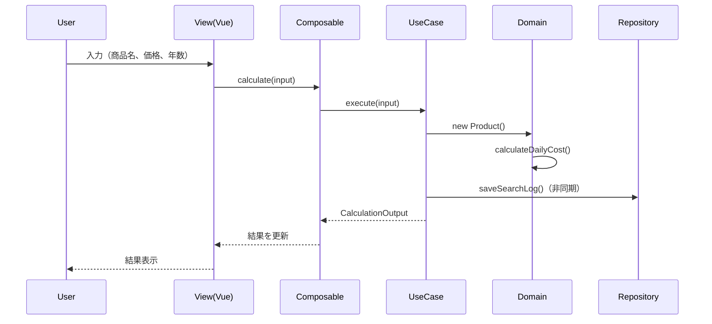
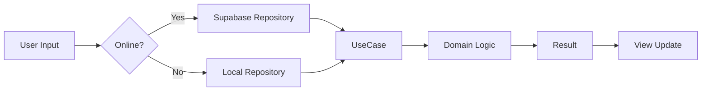

# アーキテクチャ概要

## 1. アーキテクチャ方針

### 1.1 設計思想

```yaml
基本方針:
  - Clean Architecture + Feature Slicing
  - ドメイン駆動設計（DDD-lite）
  - 関心の分離（Separation of Concerns）
  - 依存性逆転の原則（DIP）
  - テスタビリティの確保
```

### 1.2 アーキテクチャ選定理由

| 要件             | 選定アーキテクチャ | 理由                         |
| ---------------- | ------------------ | ---------------------------- |
| 保守性           | Clean Architecture | ビジネスロジックとUIの分離   |
| スケーラビリティ | Feature Slicing    | 機能単位での拡張が容易       |
| テスタビリティ   | 依存性注入         | モック化とテストの容易性     |
| オフライン対応   | レイヤー分離       | データソースの切り替えが容易 |

## 2. レイヤー設計

### 2.1 レイヤー構造

```
┌─────────────────────────────────────┐
│     Presentation Layer (Vue/Nuxt)    │
├─────────────────────────────────────┤
│      Application Layer (UseCases)     │
├─────────────────────────────────────┤
│       Domain Layer (Entities)         │
├─────────────────────────────────────┤
│    Infrastructure Layer (External)    │
└─────────────────────────────────────┘
```

### 2.2 各レイヤーの責務

#### Domain Layer（ドメイン層）

```typescript
// 責務: ビジネスルールとエンティティ
src/core/domain/
├── entities/           // ビジネスエンティティ
│   ├── Product.ts     // 商品エンティティ
│   ├── Calculation.ts // 計算結果エンティティ
│   └── HappinessScore.ts
├── valueObjects/      // 値オブジェクト
│   ├── Money.ts      // 金額
│   ├── Years.ts      // 年数
│   └── DailyCost.ts  // 日割りコスト
└── types/            // ドメイン型定義
    └── index.ts

// エンティティ例
export class Product {
  constructor(
    private readonly id: string,
    private readonly name: string,
    private readonly price: Money,
    private readonly years: Years
  ) {}

  calculateDailyCost(): DailyCost {
    return this.price.divideByDays(this.years.toDays());
  }
}
```

#### Application Layer（アプリケーション層）

```typescript
// 責務: ユースケース実装
src/core/usecases/
├── calculation/
│   ├── CalculateDailyCost.ts
│   └── CompareWithReference.ts
├── happiness/
│   └── EvaluateHappinessScore.ts
└── analytics/
    └── TrackProductSearch.ts

// ユースケース例
export class CalculateDailyCostUseCase {
  execute(input: CalculationInput): CalculationOutput {
    const product = new Product(
      input.id,
      input.name,
      Money.of(input.price),
      Years.of(input.years)
    );

    const dailyCost = product.calculateDailyCost();
    const monthlyCost = dailyCost.toMonthly();
    const yearlyCost = dailyCost.toYearly();

    return {
      daily: dailyCost.value,
      monthly: monthlyCost.value,
      yearly: yearlyCost.value,
      totalDays: product.years.toDays()
    };
  }
}
```

#### Infrastructure Layer（インフラ層）

```typescript
// 責務: 外部サービスとの連携
src/infrastructure/
├── api/
│   └── supabase/
│       ├── client.ts      // Supabaseクライアント
│       └── types.ts       // API型定義
├── repositories/
│   ├── ProductRepositoryImpl.ts
│   └── TrendsRepositoryImpl.ts
└── services/
    └── AnalyticsServiceImpl.ts

// リポジトリ実装例
export class ProductRepositoryImpl implements ProductRepository {
  constructor(private supabase: SupabaseClient) {}

  async findByName(name: string): Promise<Product[]> {
    const { data, error } = await this.supabase
      .from('products')
      .select('*')
      .ilike('name', `%${name}%`)
      .limit(10);

    if (error) throw new RepositoryError(error.message);
    return data.map(this.toDomainModel);
  }

  private toDomainModel(data: any): Product {
    return new Product(
      data.id,
      data.name,
      Money.of(data.price),
      Years.of(data.years)
    );
  }
}
```

#### Presentation Layer（プレゼンテーション層）

```typescript
// 責務: UI実装とユーザーインタラクション
src/presentation/
├── components/        // UIコンポーネント
│   ├── calculator/
│   │   ├── CalculatorForm.vue
│   │   └── ResultDisplay.vue
│   └── common/
│       └── OfflineNotice.vue
├── composables/      // Vue Composables
│   ├── useCalculation.ts
│   └── useOfflineMode.ts
├── pages/           // ページコンポーネント
│   └── index.vue
└── layouts/         // レイアウト
    └── default.vue

// Composable例
export const useCalculation = () => {
  const calculateUseCase = new CalculateDailyCostUseCase();
  const result = ref<CalculationOutput | null>(null);
  const loading = ref(false);
  const error = ref<Error | null>(null);

  const calculate = async (input: CalculationInput) => {
    loading.value = true;
    error.value = null;

    try {
      result.value = await calculateUseCase.execute(input);
    } catch (e) {
      error.value = e as Error;
    } finally {
      loading.value = false;
    }
  };

  return {
    result: readonly(result),
    loading: readonly(loading),
    error: readonly(error),
    calculate
  };
};
```

## 3. データフロー

### 3.1 計算機能のデータフロー



### 3.2 オフライン時のデータフロー



## 4. ディレクトリ構造

### 4.1 全体構造

```
nichiwari-app/
├── src/
│   ├── core/                    # ビジネスロジック層
│   │   ├── domain/             # ドメインモデル
│   │   ├── usecases/           # ユースケース
│   │   └── ports/              # インターフェース
│   │
│   ├── infrastructure/         # インフラ層
│   │   ├── api/               # 外部API
│   │   ├── repositories/       # リポジトリ実装
│   │   └── services/          # サービス実装
│   │
│   ├── presentation/           # プレゼンテーション層
│   │   ├── components/         # UIコンポーネント
│   │   ├── composables/       # Composables
│   │   ├── pages/            # ページ
│   │   ├── layouts/          # レイアウト
│   │   └── plugins/          # Nuxtプラグイン
│   │
│   └── shared/                 # 共通機能
│       ├── utils/             # ユーティリティ
│       ├── constants/         # 定数
│       ├── types/            # 共通型
│       └── i18n/             # 国際化
│
├── tests/                      # テスト
│   ├── unit/                  # 単体テスト
│   ├── integration/           # 統合テスト
│   └── e2e/                   # E2Eテスト
│
├── public/                     # 静的ファイル
├── assets/                     # アセット
└── server/                     # サーバーサイド
```

### 4.2 Feature Slicing構造

```
src/features/
├── calculator/                 # 計算機能フィーチャー
│   ├── domain/
│   ├── usecases/
│   ├── components/
│   └── composables/
│
├── happiness/                  # 幸福度診断フィーチャー
│   ├── domain/
│   ├── usecases/
│   ├── components/
│   └── composables/
│
├── trends/                     # トレンド機能フィーチャー
│   ├── domain/
│   ├── usecases/
│   ├── components/
│   └── composables/
│
└── shared/                     # フィーチャー共通
    └── components/
```

## 5. 依存性管理

### 5.1 依存関係の原則

```typescript
// ✅ 正しい依存関係
// Domain -> なし（独立）
// Application -> Domain
// Infrastructure -> Domain, Application
// Presentation -> Application, Domain

// ❌ 避けるべき依存関係
// Domain -> Infrastructure
// Application -> Infrastructure
// Domain -> Presentation
```

### 5.2 依存性注入（DI）

```typescript
// DIコンテナ設定例
export class DIContainer {
  private static instance: DIContainer
  private services: Map<string, any> = new Map()

  static getInstance(): DIContainer {
    if (!DIContainer.instance) {
      DIContainer.instance = new DIContainer()
    }
    return DIContainer.instance
  }

  register<T>(token: string, factory: () => T): void {
    this.services.set(token, factory)
  }

  resolve<T>(token: string): T {
    const factory = this.services.get(token)
    if (!factory) {
      throw new Error(`Service ${token} not found`)
    }
    return factory()
  }
}

// 登録
const container = DIContainer.getInstance()
container.register('ProductRepository', () => {
  return isOnline()
    ? new SupabaseProductRepository()
    : new LocalProductRepository()
})

// 使用
const repository = container.resolve<ProductRepository>('ProductRepository')
```

## 6. エラーハンドリング

### 6.1 エラー階層

```typescript
// エラークラス階層
export class AppError extends Error {
  constructor(
    message: string,
    public code: string,
    public statusCode?: number
  ) {
    super(message)
    this.name = this.constructor.name
  }
}

export class DomainError extends AppError {
  constructor(message: string, code: string) {
    super(message, `DOMAIN_${code}`, 400)
  }
}

export class ValidationError extends DomainError {
  constructor(message: string, public field?: string) {
    super(message, 'VALIDATION_ERROR')
  }
}

export class InfrastructureError extends AppError {
  constructor(message: string, code: string) {
    super(message, `INFRA_${code}`, 500)
  }
}
```

### 6.2 エラーハンドリング戦略

```typescript
// グローバルエラーハンドラー
export function useErrorHandler() {
  const handleError = (error: Error) => {
    if (error instanceof ValidationError) {
      // バリデーションエラー: ユーザーに表示
      showToast({
        type: 'error',
        message: error.message,
        duration: 5000
      })
    }
    else if (error instanceof InfrastructureError) {
      // インフラエラー: ログ記録 + フォールバック
      console.error(error)
      switchToOfflineMode()
    }
    else {
      // 予期しないエラー: Sentryに送信
      captureException(error)
      showToast({
        type: 'error',
        message: '予期しないエラーが発生しました',
        duration: 5000
      })
    }
  }

  return { handleError }
}
```

## 7. パフォーマンス考慮

### 7.1 最適化戦略

```yaml
コード分割:
  - ルートレベルでの自動分割
  - 動的インポートによる遅延読み込み
  - 重いライブラリの分離

キャッシング:
  - Supabaseレスポンスキャッシュ
  - 計算結果のメモ化
  - 静的データのブラウザキャッシュ

バンドルサイズ:
  - Tree Shaking
  - 未使用コードの削除
  - 圧縮・最適化
```

### 7.2 実装例

```typescript
// 遅延読み込み
const HappinessDiagnosis = defineAsyncComponent(
  () => import('@/features/happiness/components/Diagnosis.vue')
)

// メモ化
const memoizedCalculate = useMemo(
  (price: number, years: number) => {
    return price / (years * 365)
  }
)

// デバウンス
const debouncedSearch = useDebounceFn(
  async (query: string) => {
    await searchProducts(query)
  },
  500
)
```

## 関連ドキュメント

- [技術スタック選定](./tech-stack.md) - 技術選定の詳細理由
- [データモデル設計](./data-model.md) - エンティティ詳細
- [オフライン対応戦略](./offline-strategy.md) - オフライン実装
- [実装ガイド Phase 1](../05-implementation/phase-1-setup.md) - 実装開始
