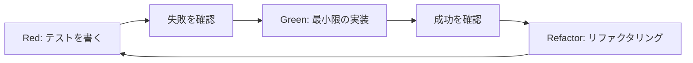

# TDD実践ガイド

## 1. TDDの基本原則

### 1.1 TDDサイクル



### 1.2 TDDの3つの法則

```yaml
第1法則:
  失敗する単体テストを書くまでプロダクションコードを書いてはいけない

第2法則:
  失敗する単体テストは、失敗するのに十分な量だけ書く

第3法則:
  現在失敗している単体テストを通すのに十分なプロダクションコードだけを書く
```

## 2. TDD実装戦略

### 2.1 仮実装（Fake It）

```typescript
// Step 1: Red - 失敗するテストを書く
describe('calculateDailyCost', () => {
  it('150,000円の商品を3年使う場合、日割り137円になる', () => {
    const result = calculateDailyCost(150000, 3);
    expect(result).toBe(137);
  });
});

// Step 2: Green - 仮実装で通す
function calculateDailyCost(price: number, years: number): number {
  return 137;  // 仮実装：ハードコードで返す
}

// Step 3: 別のテストケースを追加
it('300,000円の商品を5年使う場合、日割り164円になる', () => {
  const result = calculateDailyCost(300000, 5);
  expect(result).toBe(164);
});

// Step 4: 一般化
function calculateDailyCost(price: number, years: number): number {
  return Math.round(price / (years * 365));  // 一般化した実装
}
```

### 2.2 三角測量（Triangulation）

```typescript
// 複数のテストケースから一般化を導く
describe('Money', () => {
  // 第1のテストケース
  it('1000円 + 2000円 = 3000円', () => {
    const money1 = Money.of(1000);
    const money2 = Money.of(2000);
    const result = money1.add(money2);
    expect(result.value).toBe(3000);
  });

  // 第2のテストケース（三角測量）
  it('500円 + 500円 = 1000円', () => {
    const money1 = Money.of(500);
    const money2 = Money.of(500);
    const result = money1.add(money2);
    expect(result.value).toBe(1000);
  });

  // 第3のテストケース（エッジケース）
  it('0円 + 1000円 = 1000円', () => {
    const money1 = Money.of(0);
    const money2 = Money.of(1000);
    const result = money1.add(money2);
    expect(result.value).toBe(1000);
  });
});

// 三角測量から導かれた実装
class Money {
  constructor(private readonly _value: number) {}

  static of(value: number): Money {
    return new Money(value);
  }

  add(other: Money): Money {
    return Money.of(this._value + other._value);
  }

  get value(): number {
    return this._value;
  }
}
```

### 2.3 明白な実装（Obvious Implementation）

```typescript
// シンプルで明白な場合は直接実装
describe('Years', () => {
  it('年数を日数に変換できる', () => {
    const years = Years.of(1);
    expect(years.toDays()).toBe(365);
  });
});

// 明白な実装
class Years {
  constructor(private readonly _value: number) {}

  static of(value: number): Years {
    return new Years(value);
  }

  toDays(): number {
    return this._value * 365;  // 明白な計算式
  }
}
```

## 3. 実践的なTDDパターン

### 3.1 ドメインロジックのTDD

```typescript
// src/core/domain/entities/Product.spec.ts
import { describe, it, expect, beforeEach } from 'vitest';
import { Product } from './Product';
import { Money } from '../valueObjects/Money';
import { Years } from '../valueObjects/Years';

describe('Product', () => {
  describe('calculateDailyCost', () => {
    let product: Product;

    beforeEach(() => {
      product = new Product({
        id: 'test-001',
        name: 'テスト商品',
        price: 150000,
        years: 3,
        category: 'ガジェット'
      });
    });

    it('日割りコストを正しく計算する', () => {
      const dailyCost = product.calculateDailyCost();
      expect(dailyCost.value).toBe(137);
    });

    it('月割りコストを正しく計算する', () => {
      const monthlyCost = product.calculateMonthlyCost();
      expect(monthlyCost.value).toBe(4110);  // 137 * 30
    });

    it('年割りコストを正しく計算する', () => {
      const yearlyCost = product.calculateYearlyCost();
      expect(yearlyCost.value).toBe(50000);  // 150000 / 3
    });

    describe('比較メトリクス', () => {
      it('コーヒー換算を計算する', () => {
        const metrics = product.getComparisonMetrics();
        expect(metrics.coffeeCount).toBe(0);  // 137 / 200 = 0
      });

      it('ランチ換算を計算する', () => {
        const metrics = product.getComparisonMetrics();
        expect(metrics.lunchCount).toBe(0);  // 137 / 500 = 0
      });
    });
  });

  describe('バリデーション', () => {
    it('価格が0以下の場合エラーを投げる', () => {
      expect(() => {
        new Product({
          id: 'test',
          name: 'テスト',
          price: 0,
          years: 1
        });
      }).toThrow('価格は1円以上である必要があります');
    });

    it('年数が0.5未満の場合エラーを投げる', () => {
      expect(() => {
        new Product({
          id: 'test',
          name: 'テスト',
          price: 1000,
          years: 0.3
        });
      }).toThrow('使用年数は0.5年以上である必要があります');
    });
  });
});
```

### 3.2 ユースケースのTDD

```typescript
// src/core/usecases/calculation/CalculateDailyCost.spec.ts
import { describe, it, expect, vi } from 'vitest';
import { CalculateDailyCostUseCase } from './CalculateDailyCost';
import { ProductRepository } from '../../ports/ProductRepository';

describe('CalculateDailyCostUseCase', () => {
  let useCase: CalculateDailyCostUseCase;
  let mockRepository: ProductRepository;

  beforeEach(() => {
    // モックリポジトリの作成
    mockRepository = {
      findById: vi.fn(),
      findByName: vi.fn(),
      save: vi.fn(),
      saveSearchLog: vi.fn()
    };

    useCase = new CalculateDailyCostUseCase(mockRepository);
  });

  describe('execute', () => {
    it('計算結果を返す', async () => {
      const input = {
        productName: 'iPhone 15',
        price: 150000,
        years: 3
      };

      const result = await useCase.execute(input);

      expect(result).toEqual({
        dailyCost: 137,
        monthlyCost: 4110,
        yearlyCost: 50000,
        totalDays: 1095,
        comparisonMetrics: {
          coffeeCount: 0,
          lunchCount: 0,
          subscriptionCount: 4
        }
      });
    });

    it('検索ログを保存する', async () => {
      const input = {
        productName: 'MacBook Pro',
        price: 300000,
        years: 5
      };

      await useCase.execute(input);

      expect(mockRepository.saveSearchLog).toHaveBeenCalledWith(
        expect.objectContaining({
          productName: 'MacBook Pro',
          priceRange: '20万-50万',
          yearsRange: '5-10年',
          calculated: true
        })
      );
    });

    it('エラー時は検索ログを保存しない', async () => {
      const input = {
        productName: 'Invalid',
        price: -1000,  // 無効な価格
        years: 3
      };

      await expect(useCase.execute(input)).rejects.toThrow();
      expect(mockRepository.saveSearchLog).not.toHaveBeenCalled();
    });
  });
});
```

### 3.3 Vue ComposableのTDD

```typescript
// src/presentation/composables/useCalculation.spec.ts
import { describe, it, expect, vi } from 'vitest';
import { renderHook, waitFor } from '@testing-library/vue';
import { useCalculation } from './useCalculation';

describe('useCalculation', () => {
  it('初期状態が正しい', () => {
    const { result } = renderHook(() => useCalculation());

    expect(result.current.result.value).toBeNull();
    expect(result.current.loading.value).toBe(false);
    expect(result.current.error.value).toBeNull();
  });

  it('計算を実行できる', async () => {
    const { result } = renderHook(() => useCalculation());

    const input = {
      productName: 'テスト商品',
      price: 100000,
      years: 5
    };

    // 計算実行
    result.current.calculate(input);

    // loading状態の確認
    expect(result.current.loading.value).toBe(true);

    // 計算完了を待つ
    await waitFor(() => {
      expect(result.current.loading.value).toBe(false);
    });

    // 結果の確認
    expect(result.current.result.value).toEqual(
      expect.objectContaining({
        dailyCost: 55,
        monthlyCost: 1650,
        yearlyCost: 20000
      })
    );
  });

  it('エラーハンドリングが正しく動作する', async () => {
    const { result } = renderHook(() => useCalculation());

    const invalidInput = {
      productName: '',  // 無効な入力
      price: 0,
      years: 0
    };

    // エラーケースの実行
    result.current.calculate(invalidInput);

    await waitFor(() => {
      expect(result.current.loading.value).toBe(false);
    });

    expect(result.current.error.value).toBeInstanceOf(Error);
    expect(result.current.result.value).toBeNull();
  });

  it('リセット機能が動作する', () => {
    const { result } = renderHook(() => useCalculation());

    // 何かしらの状態を設定
    result.current.result.value = { dailyCost: 100 };
    result.current.error.value = new Error('test');

    // リセット実行
    result.current.reset();

    // 初期状態に戻ることを確認
    expect(result.current.result.value).toBeNull();
    expect(result.current.error.value).toBeNull();
    expect(result.current.loading.value).toBe(false);
  });
});
```

## 4. TDDのベストプラクティス

### 4.1 テストの命名規則

```typescript
// ✅ 良い例: 日本語で明確な期待値を記述
describe('Product', () => {
  it('150,000円の商品を3年使用する場合、日割り137円になる', () => {
    // ...
  });

  it('価格が0以下の場合、ValidationErrorを投げる', () => {
    // ...
  });
});

// ❌ 悪い例: 曖昧な命名
describe('Product', () => {
  it('should work', () => {
    // ...
  });

  it('test1', () => {
    // ...
  });
});
```

### 4.2 AAA（Arrange-Act-Assert）パターン

```typescript
describe('CalculationService', () => {
  it('複数の計算を並列実行できる', async () => {
    // Arrange: 準備
    const service = new CalculationService();
    const inputs = [
      { price: 100000, years: 3 },
      { price: 200000, years: 5 },
      { price: 300000, years: 7 }
    ];

    // Act: 実行
    const results = await service.calculateBatch(inputs);

    // Assert: 検証
    expect(results).toHaveLength(3);
    expect(results[0].dailyCost).toBe(91);
    expect(results[1].dailyCost).toBe(110);
    expect(results[2].dailyCost).toBe(117);
  });
});
```

### 4.3 テストダブル（モック・スタブ・スパイ）

```typescript
// モック: 振る舞いを定義
const mockRepository = {
  findById: vi.fn().mockResolvedValue({
    id: '001',
    name: 'iPhone',
    price: 150000
  })
};

// スタブ: 固定値を返す
const stubDateService = {
  getCurrentDate: () => new Date('2024-01-01')
};

// スパイ: 呼び出しを記録
const spyLogger = {
  log: vi.fn(),
  error: vi.fn()
};

describe('ProductService', () => {
  it('リポジトリからデータを取得する', async () => {
    const service = new ProductService(mockRepository, stubDateService, spyLogger);

    await service.getProduct('001');

    // モックの呼び出し確認
    expect(mockRepository.findById).toHaveBeenCalledWith('001');
    expect(mockRepository.findById).toHaveBeenCalledTimes(1);

    // スパイの確認
    expect(spyLogger.log).toHaveBeenCalledWith('Product fetched: 001');
  });
});
```

## 5. TDDアンチパターンと対策

### 5.1 過度なモック

```typescript
// ❌ 悪い例: すべてをモック化
describe('BadExample', () => {
  it('過度にモック化されたテスト', () => {
    const mockMoney = { value: 100 };
    const mockYears = { value: 3 };
    const mockProduct = {
      calculateDailyCost: vi.fn().mockReturnValue(mockMoney)
    };

    // 実際のロジックをテストしていない
    expect(mockProduct.calculateDailyCost()).toBe(mockMoney);
  });
});

// ✅ 良い例: 必要最小限のモック
describe('GoodExample', () => {
  it('実際のロジックをテスト', () => {
    const product = new Product({
      id: 'test',
      name: 'テスト',
      price: 109500,
      years: 3
    });

    // 実際の計算ロジックをテスト
    const dailyCost = product.calculateDailyCost();
    expect(dailyCost.value).toBe(100);
  });
});
```

### 5.2 脆弱なテスト

```typescript
// ❌ 悪い例: 実装に依存したテスト
describe('FragileTest', () => {
  it('内部実装に依存', () => {
    const service = new Service();
    // プライベートプロパティに直接アクセス
    expect(service._internalState).toBe('initial');
  });
});

// ✅ 良い例: 公開APIを通じたテスト
describe('RobustTest', () => {
  it('公開インターフェースをテスト', () => {
    const service = new Service();
    // 公開メソッドを通じて検証
    expect(service.getState()).toBe('initial');
  });
});
```

### 5.3 遅いテスト

```typescript
// ❌ 悪い例: 実際のAPIを呼ぶ
describe('SlowTest', () => {
  it('実際のAPIを呼ぶ遅いテスト', async () => {
    const data = await fetch('https://api.example.com/products');
    expect(data).toBeDefined();
  }, 10000);  // タイムアウトを延長
});

// ✅ 良い例: モックを使用
describe('FastTest', () => {
  it('モックを使った高速テスト', async () => {
    global.fetch = vi.fn().mockResolvedValue({
      json: () => Promise.resolve({ id: '001', name: 'Product' })
    });

    const data = await fetchProduct('001');
    expect(data).toBeDefined();
  });
});
```

## 6. カバレッジ目標と計測

### 6.1 カバレッジ目標

```yaml
目標値:
  単体テスト:
    statements: 90%
    branches: 85%
    functions: 90%
    lines: 90%

  統合テスト:
    statements: 70%
    branches: 70%
    functions: 70%
    lines: 70%

  E2Eテスト:
    クリティカルパス: 100%
    主要機能: 80%
```

### 6.2 カバレッジ設定

```javascript
// vitest.config.ts
export default defineConfig({
  test: {
    coverage: {
      provider: 'v8',
      reporter: ['text', 'html', 'lcov'],
      exclude: [
        'node_modules/',
        'tests/',
        '*.config.ts',
        '**/*.d.ts',
        '**/*.spec.ts',
        '**/*.test.ts'
      ],
      thresholds: {
        statements: 90,
        branches: 85,
        functions: 90,
        lines: 90
      }
    }
  }
});
```

## 7. TDDワークフロー例

### 7.1 新機能実装のフロー

```bash
# 1. フィーチャーブランチ作成
git checkout -b feature/happiness-diagnosis

# 2. 失敗するテストを書く
vim src/core/domain/entities/HappinessScore.spec.ts

# 3. テスト実行（RED）
pnpm test:unit HappinessScore

# 4. 最小限の実装
vim src/core/domain/entities/HappinessScore.ts

# 5. テスト実行（GREEN）
pnpm test:unit HappinessScore

# 6. リファクタリング
# コードを整理

# 7. テスト実行（GREEN維持）
pnpm test:unit HappinessScore

# 8. カバレッジ確認
pnpm test:coverage

# 9. コミット
git add .
git commit -m "feat: add HappinessScore entity with TDD"
```

## 8. TDDツールとコマンド

### 8.1 便利なコマンド

```json
// package.json
{
  "scripts": {
    // 単体テスト
    "test": "vitest",
    "test:unit": "vitest run",
    "test:watch": "vitest watch",

    // カバレッジ
    "test:coverage": "vitest run --coverage",
    "test:coverage:watch": "vitest watch --coverage",

    // 特定ファイルのテスト
    "test:file": "vitest run --",

    // デバッグモード
    "test:debug": "vitest --inspect-brk --single-thread",

    // UIモード
    "test:ui": "vitest --ui"
  }
}
```

### 8.2 VSCode設定

```json
// .vscode/settings.json
{
  "vitest.enable": true,
  "vitest.commandLine": "pnpm test",
  "testing.automaticallyOpenPeekView": "never",

  // テストファイルのスニペット
  "editor.snippetSuggestions": "top",

  // カバレッジ表示
  "coverage-gutters.showGutterCoverage": true,
  "coverage-gutters.showLineCoverage": true
}
```

## 関連ドキュメント

- [コーディング規約](./coding-standards.md) - コード品質基準
- [単体テスト](../04-testing/unit-testing.md) - テスト詳細
- [E2Eテスト](../04-testing/e2e-testing.md) - 統合テスト
- [Phase 2: コア機能](../05-implementation/phase-2-core.md) - TDD実装例