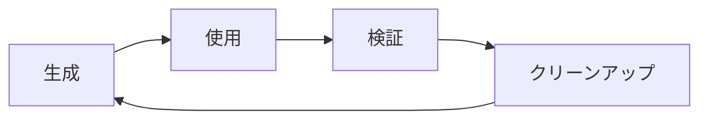

# テストデータ管理

## 1. テストデータ方針

### 1.1 データ管理原則

```yaml
基本原則:
  独立性: 各テストが独立したデータを使用
  再現性: 同じデータで同じ結果
  現実性: 実際のユースケースを反映
  最小性: 必要最小限のデータ
  安全性: 本番データを使用しない

データカテゴリ:
  - 正常系データ
  - 異常系データ
  - 境界値データ
  - パフォーマンステスト用大量データ
  - 国際化テスト用多言語データ
```

### 1.2 データライフサイクル



## 2. テストデータ定義

### 2.1 ドメインデータ

```typescript
// test/fixtures/domain-data.ts

// 商品データ
export const products = {
  valid: {
    gadget: {
      name: 'iPhone 15 Pro',
      price: 159800,
      years: 2
    },
    appliance: {
      name: '洗濯機',
      price: 120000,
      years: 10
    },
    subscription: {
      name: 'Netflix年間プラン',
      price: 15000,
      years: 1
    }
  },

  boundary: {
    minPrice: {
      name: '最小価格商品',
      price: 1,
      years: 3
    },
    maxPrice: {
      name: '最大価格商品',
      price: 1000000000,
      years: 3
    },
    minYears: {
      name: '最短期間商品',
      price: 100000,
      years: 0.5
    },
    maxYears: {
      name: '最長期間商品',
      price: 100000,
      years: 100
    }
  },

  invalid: {
    emptyName: {
      name: '',
      price: 100000,
      years: 3
    },
    longName: {
      name: 'あ'.repeat(101),
      price: 100000,
      years: 3
    },
    negativePrice: {
      name: '商品',
      price: -1,
      years: 3
    },
    zeroPrice: {
      name: '商品',
      price: 0,
      years: 3
    },
    negativeYears: {
      name: '商品',
      price: 100000,
      years: -1
    }
  }
}

// 計算結果データ
export const calculations = {
  basic: {
    id: 'calc-001',
    product: products.valid.gadget,
    dailyCost: 219, // 159800 / (2 * 365)
    createdAt: new Date('2024-01-01T00:00:00Z'),
    userId: 'user-001'
  },

  withComparisons: {
    id: 'calc-002',
    product: products.valid.appliance,
    dailyCost: 33, // 120000 / (10 * 365)
    comparisons: [
      { name: 'コンビニコーヒー', price: 150, quantity: 0.22 },
      { name: 'ペットボトル飲料', price: 150, quantity: 0.22 }
    ],
    createdAt: new Date('2024-01-02T00:00:00Z'),
    userId: 'user-001'
  }
}

// 幸福度スコアデータ
export const happinessScores = {
  high: {
    id: 'score-001',
    calculationId: 'calc-001',
    score: 85,
    factors: {
      frequency: 5, // 毎日使用
      satisfaction: 5, // 非常に満足
      necessity: 4 // 必要
    },
    message: 'とても良い買い物です！毎日使って満足度も高いですね。',
    createdAt: new Date('2024-01-01T00:00:00Z')
  },

  medium: {
    id: 'score-002',
    calculationId: 'calc-002',
    score: 60,
    factors: {
      frequency: 3,
      satisfaction: 3,
      necessity: 3
    },
    message: '適度に活用されています。もう少し頻度を上げると良いかも。',
    createdAt: new Date('2024-01-02T00:00:00Z')
  },

  low: {
    id: 'score-003',
    calculationId: 'calc-003',
    score: 30,
    factors: {
      frequency: 1,
      satisfaction: 2,
      necessity: 2
    },
    message: '使用頻度が低いようです。本当に必要か見直してみては？',
    createdAt: new Date('2024-01-03T00:00:00Z')
  }
}
```

### 2.2 UIテストデータ

```typescript
// test/fixtures/ui-data.ts

// フォーム入力データ
export const formInputs = {
  valid: {
    basic: {
      price: '150000',
      years: '3',
      name: 'ガジェット'
    },
    decimal: {
      price: '99999',
      years: '2.5',
      name: '家電'
    },
    large: {
      price: '999999999',
      years: '99',
      name: '高額商品'
    }
  },

  invalid: {
    emptyFields: {
      price: '',
      years: '',
      name: ''
    },
    invalidFormat: {
      price: 'abc',
      years: 'xyz',
      name: '123'
    },
    specialCharacters: {
      price: '¥100,000',
      years: '３年',
      name: '<script>alert("XSS")</script>'
    },
    sql: {
      price: '100000; DROP TABLE users;',
      years: '3',
      name: '\'; DELETE FROM products; --'
    }
  }
}

// 表示テキストデータ
export const displayTexts = {
  japanese: {
    title: 'にちわり！買い物の価値を見える化',
    calculateButton: '計算する',
    resetButton: 'リセット',
    dailyCostLabel: '1日あたり',
    currency: '円'
  },

  english: {
    title: 'Nichiwari! Visualize Your Purchase Value',
    calculateButton: 'Calculate',
    resetButton: 'Reset',
    dailyCostLabel: 'Per Day',
    currency: 'JPY'
  }
}
```

## 3. テストデータファクトリー

### 3.1 ビルダーパターン

```typescript
// test/factories/ProductBuilder.ts
import { Product } from '@/domain/entities/Product'
import { Money } from '@/domain/value-objects/Money'
import { Years } from '@/domain/value-objects/Years'

export class ProductBuilder {
  private name: string = 'テスト商品'
  private price: number = 100000
  private years: number = 3

  withName(name: string): this {
    this.name = name
    return this
  }

  withPrice(price: number): this {
    this.price = price
    return this
  }

  withYears(years: number): this {
    this.years = years
    return this
  }

  build(): Product {
    return new Product(
      this.name,
      new Money(this.price),
      new Years(this.years)
    )
  }

  buildMany(count: number): Product[] {
    return Array.from({ length: count }, (_, i) =>
      new Product(
        `${this.name}_${i + 1}`,
        new Money(this.price + i * 1000),
        new Years(this.years)
      ))
  }
}

// 使用例
const product = new ProductBuilder()
  .withName('iPhone')
  .withPrice(150000)
  .withYears(2)
  .build()

const products = new ProductBuilder().buildMany(10)
```

### 3.2 ファクトリー関数

```typescript
// test/factories/calculation-factory.ts
import { faker } from '@faker-js/faker'
import { Calculation } from '@/domain/entities/Calculation'

export function createCalculation(overrides: Partial<Calculation> = {}): Calculation {
  return {
    id: faker.string.uuid(),
    product: {
      name: faker.commerce.productName(),
      price: faker.number.int({ min: 1000, max: 1000000 }),
      years: faker.number.float({ min: 0.5, max: 10, precision: 0.5 })
    },
    dailyCost: faker.number.int({ min: 1, max: 1000 }),
    createdAt: faker.date.recent(),
    userId: faker.string.uuid(),
    ...overrides
  }
}

export function createCalculationList(count: number, overrides: Partial<Calculation> = {}): Calculation[] {
  return Array.from({ length: count }, () =>
    createCalculation(overrides))
}

// シード値を使った再現可能なデータ生成
export function createSeededCalculation(seed: number) {
  faker.seed(seed)
  return createCalculation()
}
```

## 4. モックデータ生成

### 4.1 APIモック

```typescript
// test/mocks/api-mocks.ts
import { rest } from 'msw'
import { setupServer } from 'msw/node'
import { calculations } from '../fixtures/domain-data'

export const handlers = [
  // 計算履歴取得
  rest.get('/api/calculations', (req, res, ctx) => {
    const limit = Number(req.url.searchParams.get('limit')) || 10
    const offset = Number(req.url.searchParams.get('offset')) || 0

    const data = createCalculationList(100)
    const paginatedData = data.slice(offset, offset + limit)

    return res(
      ctx.status(200),
      ctx.json({
        data: paginatedData,
        total: data.length,
        limit,
        offset
      })
    )
  }),

  // 計算結果保存
  rest.post('/api/calculations', async (req, res, ctx) => {
    const body = await req.json()

    if (!body.product || !body.dailyCost) {
      return res(
        ctx.status(400),
        ctx.json({ error: 'Invalid request body' })
      )
    }

    return res(
      ctx.status(201),
      ctx.json({
        id: faker.string.uuid(),
        ...body,
        createdAt: new Date().toISOString()
      })
    )
  }),

  // エラーシナリオ
  rest.get('/api/calculations/error', (req, res, ctx) => {
    return res(
      ctx.status(500),
      ctx.json({ error: 'Internal Server Error' })
    )
  }),

  // ネットワーク遅延シミュレーション
  rest.get('/api/calculations/slow', (req, res, ctx) => {
    return res(
      ctx.delay(3000),
      ctx.status(200),
      ctx.json({ data: [] })
    )
  })
]

export const server = setupServer(...handlers)
```

### 4.2 Supabaseモック

```typescript
// test/mocks/supabase-mock.ts
import { vi } from 'vitest'

export function createSupabaseMock() {
  const mockFrom = vi.fn((table: string) => ({
    select: vi.fn().mockReturnThis(),
    insert: vi.fn().mockReturnThis(),
    update: vi.fn().mockReturnThis(),
    delete: vi.fn().mockReturnThis(),
    eq: vi.fn().mockReturnThis(),
    order: vi.fn().mockReturnThis(),
    limit: vi.fn().mockReturnThis(),
    single: vi.fn().mockResolvedValue({
      data: null,
      error: null
    }),
    then: vi.fn().mockResolvedValue({
      data: [],
      error: null
    })
  }))

  return {
    from: mockFrom,
    auth: {
      getSession: vi.fn().mockResolvedValue({
        data: { session: null },
        error: null
      }),
      signInAnonymously: vi.fn().mockResolvedValue({
        data: { user: { id: 'anon-user' } },
        error: null
      })
    },
    realtime: {
      channel: vi.fn(() => ({
        on: vi.fn().mockReturnThis(),
        subscribe: vi.fn()
      }))
    }
  }
}

// 使用例
vi.mock('@/lib/supabase', () => ({
  supabase: createSupabaseMock()
}))
```

## 5. テスト環境設定

### 5.1 データベースシーディング

```typescript
// test/seed/database-seed.ts
import { createClient } from '@supabase/supabase-js'
import { calculations, happinessScores, products } from '../fixtures/domain-data'

export class DatabaseSeeder {
  private supabase: any

  constructor(url: string, key: string) {
    this.supabase = createClient(url, key)
  }

  async seed() {
    await this.clearDatabase()
    await this.seedProducts()
    await this.seedCalculations()
    await this.seedHappinessScores()
  }

  private async clearDatabase() {
    await this.supabase.from('happiness_scores').delete().neq('id', 0)
    await this.supabase.from('calculations').delete().neq('id', 0)
    await this.supabase.from('products').delete().neq('id', 0)
  }

  private async seedProducts() {
    const productData = Object.values(products.valid)
    const { error } = await this.supabase
      .from('products')
      .insert(productData)

    if (error) {
      console.error('Failed to seed products:', error)
    }
  }

  private async seedCalculations() {
    const calculationData = Object.values(calculations)
    const { error } = await this.supabase
      .from('calculations')
      .insert(calculationData)

    if (error) {
      console.error('Failed to seed calculations:', error)
    }
  }

  private async seedHappinessScores() {
    const scoreData = Object.values(happinessScores)
    const { error } = await this.supabase
      .from('happiness_scores')
      .insert(scoreData)

    if (error) {
      console.error('Failed to seed happiness scores:', error)
    }
  }

  async reset() {
    await this.clearDatabase()
  }
}

// 実行スクリプト
if (require.main === module) {
  const seeder = new DatabaseSeeder(
    process.env.SUPABASE_TEST_URL!,
    process.env.SUPABASE_TEST_SERVICE_KEY!
  )

  seeder.seed()
    .then(() => console.log('✅ Database seeded successfully'))
    .catch(error => console.error('❌ Seeding failed:', error))
}
```

### 5.2 ローカルストレージモック

```typescript
// test/mocks/localStorage-mock.ts

export class LocalStorageMock implements Storage {
  private store: Map<string, string> = new Map()

  get length(): number {
    return this.store.size
  }

  clear(): void {
    this.store.clear()
  }

  getItem(key: string): string | null {
    return this.store.get(key) || null
  }

  setItem(key: string, value: string): void {
    this.store.set(key, value)
  }

  removeItem(key: string): void {
    this.store.delete(key)
  }

  key(index: number): string | null {
    const keys = Array.from(this.store.keys())
    return keys[index] || null
  }

  // テスト用ヘルパー
  __getAllItems(): Record<string, string> {
    return Object.fromEntries(this.store)
  }

  __reset(): void {
    this.clear()
  }

  __setMultiple(items: Record<string, any>): void {
    Object.entries(items).forEach(([key, value]) => {
      this.setItem(key, JSON.stringify(value))
    })
  }
}

// グローバル設定
global.localStorage = new LocalStorageMock()
```

## 6. スナップショットテスト

### 6.1 データスナップショット

```typescript
// test/snapshots/calculation-snapshots.test.ts
import { describe, expect, it } from 'vitest'
import { createCalculation } from '../factories/calculation-factory'

describe('計算データスナップショット', () => {
  it('基本的な計算結果の構造', () => {
    const calculation = createSeededCalculation(12345)

    expect(calculation).toMatchSnapshot()
  })

  it('複数の計算結果', () => {
    const calculations = Array.from({ length: 5 }, (_, i) =>
      createSeededCalculation(i))

    expect(calculations).toMatchSnapshot()
  })
})
```

### 6.2 UIスナップショット

```typescript
// test/snapshots/component-snapshots.test.ts
import { mount } from '@vue/test-utils'
import CalculatorResult from '@/components/CalculatorResult.vue'
import { calculations } from '../fixtures/domain-data'

describe('UIコンポーネントスナップショット', () => {
  it('計算結果表示', () => {
    const wrapper = mount(CalculatorResult, {
      props: {
        calculation: calculations.basic
      }
    })

    expect(wrapper.html()).toMatchSnapshot()
  })

  it('エラー状態', () => {
    const wrapper = mount(CalculatorResult, {
      props: {
        error: '計算エラーが発生しました'
      }
    })

    expect(wrapper.html()).toMatchSnapshot()
  })
})
```

## 7. パフォーマンステストデータ

### 7.1 大量データ生成

```typescript
// test/performance/large-data-generator.ts

export class LargeDataGenerator {
  static generateCalculations(count: number): any[] {
    console.time(`Generating ${count} calculations`)

    const data = []
    const batchSize = 1000

    for (let i = 0; i < count; i += batchSize) {
      const batch = Array.from(
        { length: Math.min(batchSize, count - i) },
        (_, j) => ({
          id: `calc-${i + j}`,
          product: {
            name: `Product ${i + j}`,
            price: 100000 + (i + j) * 100,
            years: 1 + ((i + j) % 10)
          },
          dailyCost: Math.floor(100000 / 365),
          createdAt: new Date(Date.now() - i * 1000000)
        })
      )
      data.push(...batch)
    }

    console.timeEnd(`Generating ${count} calculations`)
    return data
  }

  static async* generateStream(count: number, chunkSize = 100) {
    for (let i = 0; i < count; i += chunkSize) {
      yield this.generateCalculations(
        Math.min(chunkSize, count - i)
      )
    }
  }
}

// 使用例
describe('パフォーマンステスト', () => {
  it('10000件のデータを処理できる', async () => {
    const data = LargeDataGenerator.generateCalculations(10000)

    const startTime = performance.now()
    // 処理実行
    const processed = processLargeDataSet(data)
    const endTime = performance.now()

    expect(endTime - startTime).toBeLessThan(1000) // 1秒以内
    expect(processed.length).toBe(10000)
  })
})
```

## 8. データクリーンアップ

### 8.1 テスト後のクリーンアップ

```typescript
// test/helpers/cleanup.ts

// Vitestフック
import { afterEach, beforeEach } from 'vitest'

export class TestDataCleaner {
  private cleanupTasks: (() => void | Promise<void>)[] = []

  register(task: () => void | Promise<void>) {
    this.cleanupTasks.push(task)
  }

  async cleanup() {
    for (const task of this.cleanupTasks.reverse()) {
      try {
        await task()
      }
      catch (error) {
        console.error('Cleanup task failed:', error)
      }
    }
    this.cleanupTasks = []
  }
}

const cleaner = new TestDataCleaner()

beforeEach(() => {
  // ローカルストレージクリア
  cleaner.register(() => localStorage.clear())

  // IndexedDBクリア
  cleaner.register(async () => {
    const databases = await indexedDB.databases()
    for (const db of databases) {
      if (db.name) {
        await indexedDB.deleteDatabase(db.name)
      }
    }
  })
})

afterEach(async () => {
  await cleaner.cleanup()
})
```

## 9. ベストプラクティス

### 9.1 テストデータ管理指針

```yaml
DO:
  ✓ 明確な命名規則を使用
  ✓ ビルダーパターンで柔軟性を確保
  ✓ シード値で再現性を保証
  ✓ 適切なクリーンアップを実施
  ✓ 境界値テストを含める

DON'T:
  ✗ 本番データを使用
  ✗ テスト間でデータを共有
  ✗ ハードコードされたID使用
  ✗ 巨大なフィクスチャファイル
  ✗ ランダムデータのみに依存
```

### 9.2 データセキュリティ

```typescript
// test/security/data-sanitizer.ts

export class TestDataSanitizer {
  static sanitize(data: any): any {
    if (typeof data === 'string') {
      return this.sanitizeString(data)
    }

    if (Array.isArray(data)) {
      return data.map(item => this.sanitize(item))
    }

    if (typeof data === 'object' && data !== null) {
      const sanitized: any = {}
      for (const [key, value] of Object.entries(data)) {
        if (this.isSensitiveField(key)) {
          sanitized[key] = this.maskValue(value)
        }
        else {
          sanitized[key] = this.sanitize(value)
        }
      }
      return sanitized
    }

    return data
  }

  private static isSensitiveField(field: string): boolean {
    const sensitiveFields = [
      'password',
      'token',
      'secret',
      'apiKey',
      'email',
      'phone',
      'ssn',
      'creditCard'
    ]
    return sensitiveFields.some(f =>
      field.toLowerCase().includes(f.toLowerCase())
    )
  }

  private static maskValue(value: any): string {
    const str = String(value)
    if (str.length <= 4)
      return '****'
    return str.slice(0, 2) + '*'.repeat(str.length - 4) + str.slice(-2)
  }

  private static sanitizeString(str: string): string {
    // XSS対策
    return str
      .replace(/</g, '&lt;')
      .replace(/>/g, '&gt;')
      .replace(/"/g, '&quot;')
      .replace(/'/g, '&#x27;')
      .replace(/\//g, '&#x2F;')
  }
}
```

## 関連ドキュメント

- [単体テストガイド](./unit-testing.md)
- [E2Eテストガイド](./e2e-testing.md)
- [データモデル](../02-architecture/data-model.md)
- [サンプルデータ](../07-reference/sample-data.md)
