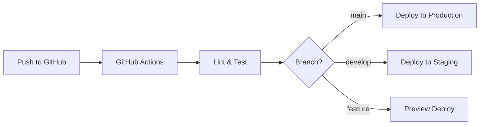

# デプロイメント設定

## 1. デプロイメント戦略

### 1.1 環境構成

```yaml
環境:
  Development:
    URL: http://localhost:3000
    用途: ローカル開発

  Staging:
    URL: https://staging.nichiwari.app
    用途: 本番前テスト

  Production:
    URL: https://nichiwari.app
    用途: 本番環境
```

### 1.2 CI/CDパイプライン



## 2. Vercel設定

### 2.1 プロジェクト設定

```bash
# Vercel CLIインストール
pnpm add -g vercel

# プロジェクト初期化
vercel

# 設定確認
vercel env pull
```

### 2.2 ビルド設定

```json
{
  "framework": "nuxtjs",
  "buildCommand": "pnpm build",
  "outputDirectory": ".output",
  "installCommand": "pnpm install --frozen-lockfile",
  "devCommand": "pnpm dev"
}
```

### 2.3 環境変数管理

```bash
# 環境変数設定
vercel env add NUXT_PUBLIC_SUPABASE_URL
vercel env add NUXT_PUBLIC_SUPABASE_ANON_KEY
vercel env add NUXT_PUBLIC_APP_URL

# 環境別設定
vercel env add NODE_ENV production --environment production
vercel env add NODE_ENV staging --environment preview
```

## 3. GitHub Actions

### 3.1 メインワークフロー

```yaml
# .github/workflows/deploy.yml
name: Deploy

on:
  push:
    branches: [main]
  pull_request:
    types: [opened, synchronize, reopened]

env:
  VERCEL_ORG_ID: ${{ secrets.VERCEL_ORG_ID }}
  VERCEL_PROJECT_ID: ${{ secrets.VERCEL_PROJECT_ID }}

jobs:
  quality:
    runs-on: ubuntu-latest
    steps:
      - uses: actions/checkout@v3

      - uses: pnpm/action-setup@v2
        with:
          version: 8

      - uses: actions/setup-node@v3
        with:
          node-version: '20'
          cache: 'pnpm'

      - run: pnpm install --frozen-lockfile

      - name: Lint
        run: pnpm lint

      - name: Type Check
        run: pnpm typecheck

      - name: Test
        run: pnpm test:unit

      - name: Build
        run: pnpm build

  deploy-preview:
    needs: quality
    runs-on: ubuntu-latest
    if: github.event_name == 'pull_request'

    steps:
      - uses: actions/checkout@v3

      - name: Deploy to Vercel
        run: |
          npm install --global vercel@latest
          vercel pull --yes --environment=preview --token=${{ secrets.VERCEL_TOKEN }}
          vercel build --token=${{ secrets.VERCEL_TOKEN }}
          vercel deploy --prebuilt --token=${{ secrets.VERCEL_TOKEN }}

  deploy-production:
    needs: quality
    runs-on: ubuntu-latest
    if: github.ref == 'refs/heads/main'

    steps:
      - uses: actions/checkout@v3

      - name: Deploy to Production
        run: |
          npm install --global vercel@latest
          vercel pull --yes --environment=production --token=${{ secrets.VERCEL_TOKEN }}
          vercel build --prod --token=${{ secrets.VERCEL_TOKEN }}
          vercel deploy --prebuilt --prod --token=${{ secrets.VERCEL_TOKEN }}
```

### 3.2 E2Eテストワークフロー

```yaml
# .github/workflows/e2e.yml
name: E2E Tests

on:
  schedule:
    - cron: '0 0 * * *' # 毎日実行
  workflow_dispatch:

jobs:
  test:
    runs-on: ubuntu-latest

    steps:
      - uses: actions/checkout@v3

      - uses: pnpm/action-setup@v2

      - uses: actions/setup-node@v3
        with:
          node-version: '20'
          cache: 'pnpm'

      - run: pnpm install --frozen-lockfile

      - name: Install Playwright
        run: pnpm playwright install --with-deps

      - name: Run E2E Tests
        run: pnpm test:e2e
        env:
          BASE_URL: ${{ secrets.STAGING_URL }}

      - uses: actions/upload-artifact@v3
        if: always()
        with:
          name: playwright-report
          path: playwright-report/
          retention-days: 30
```

## 4. デプロイメントスクリプト

### 4.1 デプロイスクリプト

```bash
#!/bin/bash
# scripts/deploy.sh

set -e

echo "🚀 Starting deployment..."

# 環境選択
if [ "$1" = "production" ]; then
    ENV="production"
    BRANCH="main"
elif [ "$1" = "staging" ]; then
    ENV="preview"
    BRANCH="develop"
else
    echo "Usage: ./deploy.sh [production|staging]"
    exit 1
fi

echo "📦 Environment: $ENV"

# ブランチ確認
CURRENT_BRANCH=$(git branch --show-current)
if [ "$CURRENT_BRANCH" != "$BRANCH" ]; then
    echo "❌ Must be on $BRANCH branch"
    exit 1
fi

# テスト実行
echo "🧪 Running tests..."
pnpm test:unit

# ビルド
echo "🔨 Building..."
pnpm build

# デプロイ
echo "☁️ Deploying to Vercel..."
if [ "$ENV" = "production" ]; then
    vercel --prod
else
    vercel
fi

echo "✅ Deployment complete!"
```

### 4.2 ロールバックスクリプト

```bash
#!/bin/bash
# scripts/rollback.sh

set -e

echo "⏪ Starting rollback..."

# デプロイメント一覧
echo "📋 Recent deployments:"
vercel ls --limit 5

# デプロイメントID入力
read -p "Enter deployment ID to rollback to: " DEPLOYMENT_ID

# ロールバック実行
echo "🔄 Rolling back to $DEPLOYMENT_ID..."
vercel rollback $DEPLOYMENT_ID

echo "✅ Rollback complete!"
```

## 5. Docker設定

### 5.1 Dockerfile

```dockerfile
# Dockerfile
FROM node:20-alpine AS base

# Install pnpm
RUN npm install -g pnpm

# Dependencies
FROM base AS deps
WORKDIR /app
COPY package.json pnpm-lock.yaml ./
RUN pnpm install --frozen-lockfile

# Builder
FROM base AS builder
WORKDIR /app
COPY --from=deps /app/node_modules ./node_modules
COPY . .
RUN pnpm build

# Runner
FROM base AS runner
WORKDIR /app

ENV NODE_ENV production

COPY --from=builder /app/.output ./.output

EXPOSE 3000

ENV NITRO_HOST=0.0.0.0
ENV NITRO_PORT=3000

CMD ["node", ".output/server/index.mjs"]
```

### 5.2 docker-compose.yml

```yaml
version: '3.8'

services:
  app:
    build: .
    ports:
      - "3000:3000"
    environment:
      - NODE_ENV=production
      - NUXT_PUBLIC_SUPABASE_URL=${NUXT_PUBLIC_SUPABASE_URL}
      - NUXT_PUBLIC_SUPABASE_ANON_KEY=${NUXT_PUBLIC_SUPABASE_ANON_KEY}
    restart: unless-stopped
    healthcheck:
      test: ["CMD", "wget", "--quiet", "--tries=1", "--spider", "http://localhost:3000/api/health"]
      interval: 30s
      timeout: 10s
      retries: 3
      start_period: 40s

  nginx:
    image: nginx:alpine
    ports:
      - "80:80"
      - "443:443"
    volumes:
      - ./nginx.conf:/etc/nginx/nginx.conf
      - ./ssl:/etc/nginx/ssl
    depends_on:
      - app
    restart: unless-stopped
```

## 6. インフラ自動化

### 6.1 Terraform設定

```hcl
# terraform/main.tf
terraform {
  required_providers {
    vercel = {
      source  = "vercel/vercel"
      version = "~> 0.3"
    }
  }
}

provider "vercel" {
  api_token = var.vercel_token
}

resource "vercel_project" "nichiwari" {
  name      = "nichiwari-app"
  framework = "nuxtjs"

  git_repository = {
    type = "github"
    repo = "username/nichiwari-app"
  }

  build_command    = "pnpm build"
  output_directory = ".output"
  install_command  = "pnpm install"

  environment = [
    {
      key    = "NUXT_PUBLIC_SUPABASE_URL"
      value  = var.supabase_url
      target = ["production", "preview"]
    },
    {
      key    = "NUXT_PUBLIC_SUPABASE_ANON_KEY"
      value  = var.supabase_anon_key
      target = ["production", "preview"]
    }
  ]
}

resource "vercel_domain" "nichiwari" {
  domain = "nichiwari.app"
  team   = var.vercel_team
}

resource "vercel_project_domain" "nichiwari" {
  project_id = vercel_project.nichiwari.id
  domain     = vercel_domain.nichiwari.domain
}
```

## 7. 監視とアラート

### 7.1 ヘルスチェック

```typescript
// server/api/health.ts
export default defineEventHandler(async (event) => {
  try {
    // データベース接続確認
    const { error } = await useSupabase()
      .from('calculations')
      .select('count')
      .limit(1)

    if (error) throw error

    return {
      status: 'healthy',
      timestamp: new Date().toISOString(),
      version: process.env.npm_package_version,
      environment: process.env.NODE_ENV
    }
  } catch (error) {
    setResponseStatus(event, 503)
    return {
      status: 'unhealthy',
      error: error.message,
      timestamp: new Date().toISOString()
    }
  }
})
```

### 7.2 デプロイ通知

```yaml
# .github/workflows/notify.yml
name: Deployment Notification

on:
  deployment_status:

jobs:
  notify:
    if: github.event.deployment_status.state == 'success'
    runs-on: ubuntu-latest

    steps:
      - name: Send Slack Notification
        uses: slackapi/slack-github-action@v1
        with:
          payload: |
            {
              "text": "Deployment Successful! 🎉",
              "blocks": [
                {
                  "type": "section",
                  "text": {
                    "type": "mrkdwn",
                    "text": "*Deployment Complete*\n• Environment: ${{ github.event.deployment.environment }}\n• URL: ${{ github.event.deployment_status.target_url }}\n• Deployed by: ${{ github.actor }}"
                  }
                }
              ]
            }
        env:
          SLACK_WEBHOOK_URL: ${{ secrets.SLACK_WEBHOOK_URL }}
```

## 8. パフォーマンスモニタリング

```typescript
// plugins/performance.client.ts
export default defineNuxtPlugin(() => {
  // Web Vitals測定
  if ('web-vital' in window) {
    import('web-vitals').then(({ getCLS, getFID, getFCP, getLCP, getTTFB }) => {
      getCLS(sendMetric)
      getFID(sendMetric)
      getFCP(sendMetric)
      getLCP(sendMetric)
      getTTFB(sendMetric)
    })
  }

  function sendMetric({ name, value, id }) {
    // Vercel Analyticsに送信
    if (window.va) {
      window.va('event', {
        name: 'Web Vitals',
        properties: {
          metric: name,
          value: Math.round(value),
          id
        }
      })
    }
  }
})
```

## 9. 災害復旧計画

```yaml
RTO (Recovery Time Objective): 1時間
RPO (Recovery Point Objective): 1日

バックアップ:
  - コード: GitHub（即座復旧可能）
  - データベース: Supabase日次バックアップ
  - 設定: Vercel環境変数

復旧手順:
  1. 障害検知（監視アラート）
  2. 原因調査（ログ確認）
  3. 復旧方法決定
  4. ロールバック or ホットフィックス
  5. 動作確認
  6. 監視強化
```

## 関連ドキュメント

- [Phase 5 - リリース準備](../05-implementation/phase-5-release.md)
- [監視設定](./monitoring.md)
- [セキュリティ](./security.md)