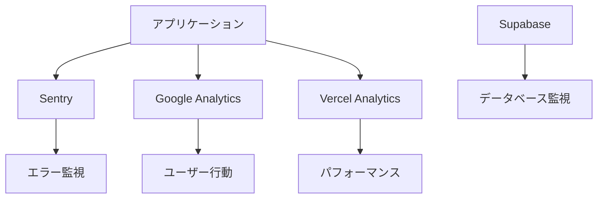

# 監視設定

## 1. 監視戦略

### 1.1 監視対象

```yaml
アプリケーション:
  - エラー率
  - レスポンスタイム
  - スループット
  - 可用性

インフラ:
  - CPU使用率
  - メモリ使用量
  - ディスク使用量
  - ネットワーク

ビジネス:
  - ユーザー数
  - 計算実行数
  - エラー発生数
  - 離脱率
```

### 1.2 監視ツール構成



## 2. Sentry設定

### 2.1 初期設定

```typescript
// nuxt.config.ts
export default defineNuxtConfig({
  modules: ['@nuxtjs/sentry'],

  sentry: {
    dsn: process.env.SENTRY_DSN,
    disabled: process.env.NODE_ENV === 'development',
    config: {
      environment: process.env.NODE_ENV,
      tracesSampleRate: process.env.NODE_ENV === 'production' ? 0.1 : 1.0,
      replaysSessionSampleRate: 0.1,
      replaysOnErrorSampleRate: 1.0,
      integrations: [
        new Sentry.Replay({
          maskAllText: false,
          blockAllMedia: false
        })
      ]
    }
  }
})
```

### 2.2 エラー監視

```typescript
// composables/useSentryMonitoring.ts
export function useSentryMonitoring() {
  const captureError = (error: Error, context?: any) => {
    if (process.env.NODE_ENV === 'development') {
      console.error('Error captured:', error, context)
      return
    }

    Sentry.captureException(error, {
      extra: context,
      tags: {
        section: getCurrentSection(),
        feature: getCurrentFeature()
      }
    })
  }

  const captureMessage = (message: string, level: 'info' | 'warning' | 'error' = 'info') => {
    Sentry.captureMessage(message, level)
  }

  const measurePerformance = async (name: string, fn: () => Promise<any>) => {
    const transaction = Sentry.startTransaction({ name })

    try {
      const result = await fn()
      transaction.setStatus('ok')
      return result
    }
    catch (error) {
      transaction.setStatus('internal_error')
      throw error
    }
    finally {
      transaction.finish()
    }
  }

  const setUser = (user: any) => {
    Sentry.setUser({
      id: user.id,
      email: user.email,
      username: user.username
    })
  }

  return {
    captureError,
    captureMessage,
    measurePerformance,
    setUser
  }
}
```

## 3. Google Analytics

### 3.1 イベントトラッキング

```typescript
// composables/useAnalytics.ts
export function useAnalytics() {
  const config = useRuntimeConfig()

  const trackEvent = (action: string, category: string, label?: string, value?: number) => {
    if (typeof gtag === 'undefined')
      return

    gtag('event', action, {
      event_category: category,
      event_label: label,
      value
    })
  }

  // カスタムイベント
  const trackCalculation = (price: number, years: number, dailyCost: number) => {
    trackEvent('calculate', 'engagement', 'calculation', Math.round(dailyCost))

    // 価格帯別トラッキング
    const priceRange = getPriceRange(price)
    trackEvent('price_range', 'calculation', priceRange)

    // 使用年数別トラッキング
    const yearsRange = getYearsRange(years)
    trackEvent('years_range', 'calculation', yearsRange)
  }

  const trackShare = (method: string) => {
    trackEvent('share', 'social', method)
  }

  const trackPWAInstall = (outcome: 'accepted' | 'dismissed') => {
    trackEvent('pwa_install', 'engagement', outcome)
  }

  const trackError = (error: string, fatal = false) => {
    trackEvent('exception', 'error', error, fatal ? 1 : 0)
  }

  return {
    trackEvent,
    trackCalculation,
    trackShare,
    trackPWAInstall,
    trackError
  }
}

function getPriceRange(price: number): string {
  if (price < 10000)
    return '0-10k'
  if (price < 50000)
    return '10k-50k'
  if (price < 100000)
    return '50k-100k'
  if (price < 500000)
    return '100k-500k'
  return '500k+'
}

function getYearsRange(years: number): string {
  if (years <= 1)
    return '0-1'
  if (years <= 3)
    return '1-3'
  if (years <= 5)
    return '3-5'
  if (years <= 10)
    return '5-10'
  return '10+'
}
```

### 3.2 ユーザーフロー分析

```typescript
// plugins/analytics-flow.client.ts
export default defineNuxtPlugin(() => {
  const route = useRoute()
  const { trackEvent } = useAnalytics()

  // ページビュー追跡
  watch(() => route.path, (path) => {
    if (typeof gtag === 'undefined')
      return

    gtag('config', useRuntimeConfig().public.gaId, {
      page_path: path
    })
  })

  // セッション時間追跡
  const sessionStart = Date.now()

  onMounted(() => {
    trackEvent('session_start', 'engagement')
  })

  onBeforeUnmount(() => {
    const duration = Math.round((Date.now() - sessionStart) / 1000)
    trackEvent('session_duration', 'engagement', undefined, duration)
  })
})
```

## 4. パフォーマンス監視

### 4.1 Web Vitals

```typescript
// plugins/web-vitals.client.ts
import { getCLS, getFCP, getFID, getLCP, getTTFB } from 'web-vitals'

export default defineNuxtPlugin(() => {
  const sendMetric = ({ name, delta, id, value }) => {
    // Vercel Analyticsに送信
    if (window.va) {
      window.va('event', {
        name: 'Web Vitals',
        properties: {
          metric: name,
          value: Math.round(name === 'CLS' ? delta * 1000 : delta),
          page: window.location.pathname
        }
      })
    }

    // Google Analyticsに送信
    if (typeof gtag !== 'undefined') {
      gtag('event', name, {
        value: Math.round(name === 'CLS' ? delta * 1000 : delta),
        metric_id: id,
        metric_value: value,
        metric_delta: delta
      })
    }

    // 閾値チェック
    checkThreshold(name, value)
  }

  // Web Vitals測定
  getCLS(sendMetric)
  getFID(sendMetric)
  getFCP(sendMetric)
  getLCP(sendMetric)
  getTTFB(sendMetric)
})

function checkThreshold(metric: string, value: number) {
  const thresholds = {
    CLS: 0.1,
    FID: 100,
    FCP: 1800,
    LCP: 2500,
    TTFB: 800
  }

  if (value > thresholds[metric]) {
    console.warn(`Performance warning: ${metric} = ${value}ms (threshold: ${thresholds[metric]}ms)`)

    // アラート送信
    if (window.Sentry) {
      Sentry.captureMessage(`Performance degradation: ${metric}`, 'warning')
    }
  }
}
```

### 4.2 リソース監視

```typescript
// composables/useResourceMonitoring.ts
export function useResourceMonitoring() {
  const checkMemoryUsage = () => {
    if (!performance.memory)
      return null

    const used = performance.memory.usedJSHeapSize
    const limit = performance.memory.jsHeapSizeLimit
    const percentage = (used / limit) * 100

    if (percentage > 90) {
      console.warn(`High memory usage: ${percentage.toFixed(2)}%`)
      Sentry?.captureMessage('High memory usage detected', 'warning')
    }

    return {
      used: Math.round(used / 1024 / 1024), // MB
      limit: Math.round(limit / 1024 / 1024), // MB
      percentage: percentage.toFixed(2)
    }
  }

  const checkNetworkSpeed = () => {
    if (!navigator.connection)
      return null

    return {
      effectiveType: navigator.connection.effectiveType,
      downlink: navigator.connection.downlink,
      rtt: navigator.connection.rtt,
      saveData: navigator.connection.saveData
    }
  }

  const monitorLongTasks = () => {
    if (!PerformanceObserver)
      return

    const observer = new PerformanceObserver((list) => {
      for (const entry of list.getEntries()) {
        if (entry.duration > 50) {
          console.warn('Long task detected:', entry)

          gtag?.('event', 'long_task', {
            value: Math.round(entry.duration),
            event_category: 'performance'
          })
        }
      }
    })

    observer.observe({ entryTypes: ['longtask'] })
  }

  return {
    checkMemoryUsage,
    checkNetworkSpeed,
    monitorLongTasks
  }
}
```

## 5. カスタムダッシュボード

### 5.1 管理画面

```vue
<!-- pages/admin/dashboard.vue -->
<script setup lang="ts">
const metrics = ref({
  activeUsers: 0,
  activeUsersChange: 0,
  errorRate: 0,
  errorRateChange: 0,
  avgResponse: 0,
  avgResponseChange: 0,
  calculations: 0,
  calculationsChange: 0
})

const performanceData = ref([])
const errorData = ref([])
const alerts = ref([])

// リアルタイム更新
const { data } = await useFetch('/api/admin/metrics', {
  refresh: true,
  refreshInterval: 5000 // 5秒ごと更新
})

watch(data, (newData) => {
  metrics.value = newData.metrics
  performanceData.value = newData.performance
  errorData.value = newData.errors
  alerts.value = newData.alerts
})
</script>

<template>
  <div class="dashboard">
    <h1>監視ダッシュボード</h1>

    <!-- リアルタイムメトリクス -->
    <div class="metrics-grid">
      <MetricCard
        title="アクティブユーザー"
        :value="metrics.activeUsers"
        :change="metrics.activeUsersChange"
      />
      <MetricCard
        title="エラー率"
        :value="`${metrics.errorRate}%`"
        :change="metrics.errorRateChange"
        :status="metrics.errorRate > 1 ? 'warning' : 'success'"
      />
      <MetricCard
        title="平均レスポンス"
        :value="`${metrics.avgResponse}ms`"
        :change="metrics.avgResponseChange"
      />
      <MetricCard
        title="計算実行数"
        :value="metrics.calculations"
        :change="metrics.calculationsChange"
      />
    </div>

    <!-- パフォーマンスグラフ -->
    <div class="charts">
      <PerformanceChart :data="performanceData" />
      <ErrorChart :data="errorData" />
    </div>

    <!-- アラート -->
    <div class="alerts">
      <Alert
        v-for="alert in alerts"
        :key="alert.id"
        :alert="alert"
        @dismiss="dismissAlert(alert.id)"
      />
    </div>
  </div>
</template>
```

## 6. アラート設定

### 6.1 アラートルール

```yaml
エラー率:
  閾値: 1%
  期間: 5分
  アクション: Slack通知

レスポンス遅延:
  閾値: 3000ms
  期間: 5分
  アクション: メール通知

ダウンタイム:
  閾値: 1分
  アクション: 電話通知

メモリ使用率:
  閾値: 90%
  期間: 10分
  アクション: 自動再起動
```

### 6.2 アラート通知

```typescript
// server/api/alerts/notify.ts
export default defineEventHandler(async (event) => {
  const { type, severity, message, metrics } = await readBody(event)

  // Slack通知
  if (severity >= 'warning') {
    await sendSlackNotification({
      type,
      severity,
      message,
      metrics,
      timestamp: new Date().toISOString()
    })
  }

  // メール通知
  if (severity === 'critical') {
    await sendEmailNotification({
      to: process.env.ALERT_EMAIL,
      subject: `[CRITICAL] ${type}`,
      body: formatAlertEmail(message, metrics)
    })
  }

  return { success: true }
})

async function sendSlackNotification(alert: any) {
  const webhook = process.env.SLACK_WEBHOOK_URL

  await $fetch(webhook, {
    method: 'POST',
    body: {
      text: `🚨 Alert: ${alert.type}`,
      attachments: [{
        color: alert.severity === 'critical' ? 'danger' : 'warning',
        fields: [
          {
            title: 'Message',
            value: alert.message,
            short: false
          },
          {
            title: 'Metrics',
            value: JSON.stringify(alert.metrics, null, 2),
            short: false
          }
        ],
        timestamp: alert.timestamp
      }]
    }
  })
}
```

## 7. ログ収集

### 7.1 構造化ログ

```typescript
// utils/logger.ts
class Logger {
  private context: string

  constructor(context: string) {
    this.context = context
  }

  private format(level: string, message: string, data?: any) {
    return {
      timestamp: new Date().toISOString(),
      level,
      context: this.context,
      message,
      data,
      environment: process.env.NODE_ENV,
      version: process.env.npm_package_version
    }
  }

  info(message: string, data?: any) {
    const log = this.format('INFO', message, data)
    console.log(JSON.stringify(log))
  }

  warn(message: string, data?: any) {
    const log = this.format('WARN', message, data)
    console.warn(JSON.stringify(log))
  }

  error(message: string, error?: Error, data?: any) {
    const log = this.format('ERROR', message, {
      ...data,
      error: {
        message: error?.message,
        stack: error?.stack,
        name: error?.name
      }
    })
    console.error(JSON.stringify(log))
  }

  metric(name: string, value: number, tags?: Record<string, any>) {
    const log = this.format('METRIC', name, {
      value,
      tags
    })
    console.log(JSON.stringify(log))
  }
}

export const createLogger = (context: string) => new Logger(context)
```

## 8. SLO/SLA定義

```yaml
SLO (Service Level Objectives):
  可用性: 99.9% (月間43分以内のダウンタイム)
  レスポンスタイム: 95%が2秒以内
  エラー率: 0.1%未満

SLA (Service Level Agreement):
  可用性保証: 99.5%
  補償:
    99.0-99.5%: 10%クレジット
    95.0-99.0%: 25%クレジット
    95.0%未満: 50%クレジット

測定方法:
  - 5分間隔でヘルスチェック
  - 外部監視サービス使用
  - 月次レポート作成
```

## 関連ドキュメント

- [デプロイメント設定](./deployment.md)
- [セキュリティ](./security.md)
- [Phase 4 - 機能改善](../05-implementation/phase-4-polish.md)
