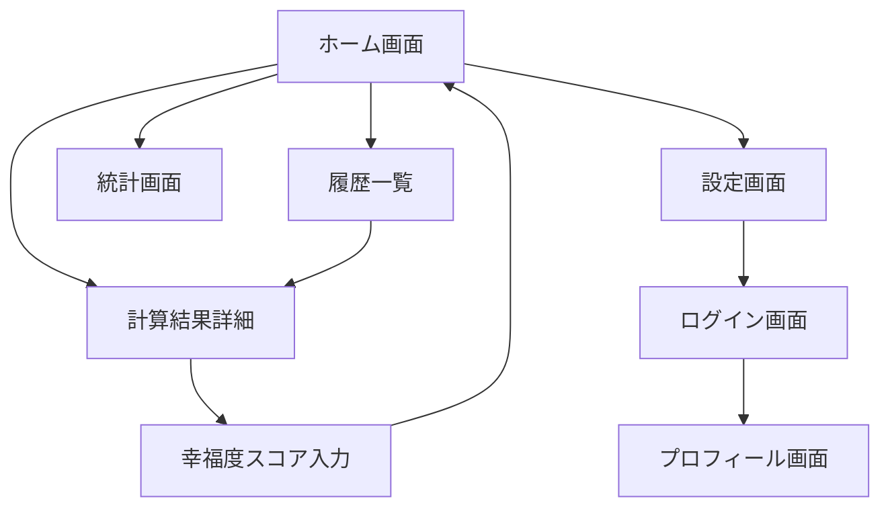

# 画面設計書

## 1. 画面一覧

### 1.1 画面構成（Phase別）

```yaml
Phase 1 (MVP):
  - ホーム画面（計算フォーム + 結果表示）
  - 計算結果詳細画面
  - 幸福度スコア入力モーダル

Phase 2 (拡張):
  - 履歴一覧画面
  - 統計画面
  - 設定画面

Phase 3 (高度機能):
  - ユーザー登録・ログイン画面
  - プロフィール画面
  - 比較アイテムカスタマイズ画面
```

### 1.2 画面遷移図



---

## 2. Phase 1 画面設計（MVP）

### 2.1 ホーム画面（計算フォーム + 結果表示）

#### レイアウト構成

```
┌─────────────────────────────────────┐
│  [ロゴ] にちわり！           [☰]  │ ← ヘッダー
├─────────────────────────────────────┤
│                                     │
│  買ったものの価値を               │
│  日割りで見える化！               │
│                                     │
│  ┌───────────────────────────────┐ │
│  │ 📦 商品名（任意）              │ │
│  │ [                          ] │ │
│  └───────────────────────────────┘ │
│                                     │
│  ┌───────────────────────────────┐ │
│  │ 💰 購入価格（必須）            │ │
│  │ [           ] 円             │ │
│  └───────────────────────────────┘ │
│                                     │
│  ┌───────────────────────────────┐ │
│  │ 📅 使用年数（必須）            │ │
│  │ [     ] 年 [スライダー]       │ │
│  │ 0.5年 ━━●━━━━━━━ 10年+       │ │
│  └───────────────────────────────┘ │
│                                     │
│         [  計算する  ] ← ボタン     │
│                                     │
│  ─────────────────────────────────  │ ← 結果エリア
│                                     │
│         💡 1日あたり                │
│                                     │
│           ¥ 219                    │ ← 超大きいフォント
│                                     │
│  ─────────────────────────────────  │
│                                     │
│  📊 身近なもので例えると…          │
│                                     │
│  🍙 おにぎり 1個分                 │
│  ☕ コンビニコーヒー 2杯分          │
│  🍜 カップラーメン 1個分            │
│                                     │
│  ─────────────────────────────────  │
│                                     │
│  [  結果を保存  ]  [  共有  ]      │
│                                     │
└─────────────────────────────────────┘
```

#### 要素詳細

**1. ヘッダー**
```yaml
要素:
  - ロゴ: テキスト「にちわり！」+ アイコン
  - ハンバーガーメニュー: 右上

レスポンシブ:
  - モバイル: 固定ヘッダー（スクロール時も表示）
  - デスクトップ: 横幅最大1200px、センタリング
```

**2. ヒーローセクション**
```yaml
要素:
  - キャッチコピー: 「買ったものの価値を日割りで見える化！」
  - サブコピー（オプション）: 「本当にお得か、一目でわかる」

スタイル:
  - フォントサイズ: 24px (モバイル), 32px (デスクトップ)
  - 中央揃え
  - マージン: 上下24px
```

**3. 入力フォーム**

**(a) 商品名フィールド**
```yaml
ラベル: 📦 商品名（任意）
入力タイプ: text
プレースホルダー: 「例: iPhone 15 Pro」
バリデーション:
  - 最大100文字
  - 絵文字許可

UI仕様:
  - 角丸: 8px
  - ボーダー: 1px solid #E0E0E0
  - フォーカス時: ボーダー #42A5F5
  - パディング: 12px 16px
```

**(b) 購入価格フィールド**
```yaml
ラベル: 💰 購入価格（必須）
入力タイプ: number
プレースホルダー: 「100000」
単位表示: 右側に「円」固定

バリデーション:
  - 最小値: 1
  - 最大値: 1,000,000,000
  - リアルタイム: カンマ区切り表示

UI仕様:
  - 右寄せ
  - フォントサイズ: 18px（大きめ）
  - 数値入力専用キーボード（モバイル）
```

**(c) 使用年数フィールド**
```yaml
ラベル: 📅 使用年数（必須）
入力タイプ: dual（数値入力 + スライダー）

数値入力:
  - 最小値: 0.5
  - 最大値: 100
  - ステップ: 0.5

スライダー:
  - デフォルト範囲: 0.5〜10年
  - 10年超: 数値入力で対応
  - 色: プライマリカラー (#42A5F5)

UI仕様:
  - スライダー優先、細かい調整は数値入力
  - モバイル: 大きめのスライダーつまみ（タップしやすい）
```

**4. 計算ボタン**
```yaml
テキスト: 「計算する」
スタイル:
  - 背景色: #42A5F5（プライマリ）
  - 文字色: #FFFFFF
  - 角丸: 24px（ピル型）
  - パディング: 16px 48px
  - フォントサイズ: 16px
  - フォントウェイト: 600

インタラクション:
  - ホバー: 背景色 #1E88E5（濃く）
  - プレス: スケール 0.98
  - ローディング中: スピナー表示

配置:
  - 中央揃え
  - マージン: 上下24px
```

**5. 結果エリア**

**(a) 日割り金額表示**
```yaml
レイアウト:
  ┌─────────────────┐
  │  💡 1日あたり   │ ← 12px, グレー
  │                 │
  │    ¥ 219        │ ← 48px, 太字, プライマリカラー
  │                 │
  └─────────────────┘

アニメーション:
  - 表示時: フェードイン + カウントアップ（0→219）
  - 所要時間: 800ms
  - イージング: ease-out

背景:
  - 薄いグラデーション
  - box-shadow: 0 2px 8px rgba(0,0,0,0.1)
  - 角丸: 16px
```

**(b) 比較アイテムリスト**
```yaml
レイアウト:
  [絵文字] [アイテム名] [数量]

  例:
  🍙 おにぎり           1個分
  ☕ コンビニコーヒー   2杯分
  🍜 カップラーメン     1個分

スタイル:
  - リスト形式
  - 各アイテム間: 8px マージン
  - 絵文字サイズ: 24px
  - テキストサイズ: 16px
  - 数量: 右寄せ、セミボールド

インタラクション:
  - ホバー: 背景色変更（薄いグレー）
  - クリック: アイテム詳細表示（Phase 2）

表示件数:
  - デフォルト: 3件
  - 「もっと見る」で追加3件表示
```

**6. アクションボタン**
```yaml
配置: 横並び（モバイルは縦並び）

[結果を保存]:
  - スタイル: secondary（白背景、ボーダー）
  - アイコン: 💾
  - 動作: Supabaseに保存（ログイン必要）

[共有]:
  - スタイル: secondary
  - アイコン: 🔗
  - 動作: Web Share API
```

#### レスポンシブ対応

```yaml
モバイル（〜768px）:
  - 1カラムレイアウト
  - パディング: 16px
  - フォントサイズ: 基準
  - タッチ対象最小: 44px

タブレット（768px〜1024px）:
  - 最大幅: 600px、センタリング
  - パディング: 24px

デスクトップ（1024px〜）:
  - 最大幅: 800px、センタリング
  - 左右余白: 自動
  - フォントサイズ: 1.1倍
```

---

### 2.2 計算結果詳細画面

#### レイアウト構成

```
┌─────────────────────────────────────┐
│  [←] にちわり！                     │ ← ヘッダー
├─────────────────────────────────────┤
│                                     │
│  📦 iPhone 15 Pro                  │ ← 商品名
│  ¥159,800 / 2年使用                │ ← 詳細情報
│                                     │
│  ─────────────────────────────────  │
│                                     │
│         💡 1日あたり                │
│                                     │
│           ¥ 219                    │
│                                     │
│  ─────────────────────────────────  │
│                                     │
│  📊 比較アイテム（すべて）          │
│                                     │
│  🍙 おにぎり            1個分       │
│  ☕ コンビニコーヒー    2杯分       │
│  🍜 カップラーメン      1個分       │
│  🥪 サンドイッチ        0.6個分     │
│  🍱 ランチ              0.3食分     │
│                                     │
│  ─────────────────────────────────  │
│                                     │
│  😊 幸福度を評価する                │
│                                     │
│  [  評価する  ]                     │
│                                     │
│  ─────────────────────────────────  │
│                                     │
│  [  編集  ]  [  削除  ]  [  共有  ] │
│                                     │
└─────────────────────────────────────┘
```

#### 要素詳細

**1. ヘッダー**
```yaml
要素:
  - 戻るボタン: 左上、アイコン「←」
  - タイトル: 「にちわり！」

動作:
  - 戻る: ホーム画面またはブラウザバック
```

**2. 商品情報カード**
```yaml
要素:
  - 商品名: 大きめフォント（20px）
  - 価格/年数: 小さめフォント（14px）、グレー

スタイル:
  - 背景: 白
  - パディング: 16px
  - 角丸: 12px
  - box-shadow
```

**3. 日割り金額表示**
```yaml
ホーム画面と同じスタイル
```

**4. 比較アイテム全件表示**
```yaml
表示件数: 制限なし（全件表示）
スクロール: 縦スクロール可能
```

**5. 幸福度評価セクション**
```yaml
ラベル: 「😊 幸福度を評価する」
説明: 「この買い物、どれくらい満足してる？」

ボタン:
  - テキスト: 「評価する」
  - スタイル: primary
  - 動作: 幸福度スコア入力モーダル表示
```

**6. アクションボタン群**
```yaml
[編集]:
  - アイコン: ✏️
  - 動作: ホーム画面に戻って入力値復元

[削除]:
  - アイコン: 🗑️
  - 動作: 確認ダイアログ → 削除 → ホーム画面

[共有]:
  - アイコン: 🔗
  - 動作: Web Share API
```

---

### 2.3 幸福度スコア入力モーダル

#### レイアウト構成

```
┌─────────────────────────────────────┐
│                                     │
│  ─────────────────────────────────  │
│                                     │
│  😊 この買い物、どうだった？        │
│                                     │
│  ┌───────────────────────────────┐ │
│  │ 📈 使用頻度                    │ │
│  │                               │ │
│  │ ○ ○ ○ ○ ○                   │ │
│  │ ほぼ    たまに   毎日        │ │
│  │ 使わない        使う         │ │
│  └───────────────────────────────┘ │
│                                     │
│  ┌───────────────────────────────┐ │
│  │ ⭐ 満足度                      │ │
│  │                               │ │
│  │ ○ ○ ○ ○ ○                   │ │
│  │ 不満    普通    超満足       │ │
│  └───────────────────────────────┘ │
│                                     │
│  ┌───────────────────────────────┐ │
│  │ 💡 必要性                      │ │
│  │                               │ │
│  │ ○ ○ ○ ○ ○                   │ │
│  │ なくても  あると  絶対       │ │
│  │ いい     便利    必要        │ │
│  └───────────────────────────────┘ │
│                                     │
│  ─────────────────────────────────  │
│                                     │
│  幸福度スコア: 80 / 100            │
│  ████████░░ 80%                    │
│                                     │
│  「めっちゃいい買い物！✨」         │
│                                     │
│  ─────────────────────────────────  │
│                                     │
│  [  キャンセル  ]  [  保存  ]      │
│                                     │
└─────────────────────────────────────┘
```

#### 要素詳細

**1. モーダル設計**
```yaml
背景オーバーレイ:
  - 半透明黒（rgba(0,0,0,0.6)）
  - クリックで閉じる

モーダルボックス:
  - 最大幅: 400px
  - パディング: 24px
  - 角丸: 16px
  - box-shadow: 大きめ

アニメーション:
  - 表示: スライドイン（下から上）
  - 非表示: フェードアウト
```

**2. 評価項目（3つ）**

各項目共通仕様:
```yaml
レイアウト:
  - ラベル: 絵文字 + テキスト
  - 選択肢: 5段階（ラジオボタン風）
  - 説明ラベル: 左（1）、中央（3）、右（5）

インタラクション:
  - タップ/クリックで選択
  - 選択時: 塗りつぶし + アニメーション
  - 未選択: 枠線のみ

スタイル:
  - サイズ: 48px × 48px（タップしやすい）
  - 選択時色: プライマリカラー
  - 未選択色: グレー
```

**3. リアルタイムスコア計算**
```yaml
表示タイミング: 3つすべて選択後

計算式:
  score = (frequency * 0.4 + satisfaction * 0.4 + necessity * 0.2) * 20

表示形式:
  - 数値: 「80 / 100」
  - プログレスバー: 塗りつぶし率80%
  - メッセージ: スコアに応じた一言

メッセージ例:
  - 90-100: 「めっちゃいい買い物！✨」
  - 70-89: 「なかなか良い買い物だね！」
  - 50-69: 「そこそこかな」
  - 30-49: 「もっといいのあったかも...」
  - 0-29: 「次はもっと考えよう💦」

アニメーション:
  - カウントアップ: 0→80（800ms）
  - プログレスバー: 幅0%→80%
```

**4. アクションボタン**
```yaml
[キャンセル]:
  - スタイル: secondary
  - 動作: モーダル閉じる

[保存]:
  - スタイル: primary
  - 動作: Supabaseに保存 → モーダル閉じる → 詳細画面更新
```

---

## 3. Phase 2 画面設計（拡張）

### 3.1 履歴一覧画面

```
┌─────────────────────────────────────┐
│  [←] 計算履歴                       │
├─────────────────────────────────────┤
│                                     │
│  📅 今月                            │
│                                     │
│  ┌───────────────────────────────┐ │
│  │ 📦 iPhone 15 Pro               │ │
│  │ ¥219/日  •  2024/11/22         │ │
│  │ ⭐ 80点                         │ │
│  └───────────────────────────────┘ │
│                                     │
│  ┌───────────────────────────────┐ │
│  │ 📦 MacBook Air M2              │ │
│  │ ¥113/日  •  2024/11/20         │ │
│  │ 未評価                         │ │
│  └───────────────────────────────┘ │
│                                     │
│  📅 先月                            │
│                                     │
│  ┌───────────────────────────────┐ │
│  │ 📦 洗濯機                      │ │
│  │ ¥55/日  •  2024/10/15          │ │
│  │ ⭐ 92点                         │ │
│  └───────────────────────────────┘ │
│                                     │
└─────────────────────────────────────┘
```

**要素詳細:**
```yaml
カードスタイル:
  - 白背景
  - 角丸: 12px
  - box-shadow
  - パディング: 16px
  - スワイプで削除（モバイル）

カード内容:
  - 商品名: 18px, bold
  - 日割り金額: 16px, プライマリカラー
  - 日付: 14px, グレー
  - 幸福度スコア: 14px, アクセントカラー

インタラクション:
  - タップ: 計算結果詳細画面へ
  - 左スワイプ: 削除ボタン表示
```

---

### 3.2 統計画面

```
┌─────────────────────────────────────┐
│  [←] 統計                           │
├─────────────────────────────────────┤
│                                     │
│  📊 あなたの買い物データ            │
│                                     │
│  ┌─────────┬─────────┬─────────┐ │
│  │ 計算回数│ 平均日額│平均満足度│ │
│  │   12回  │  ¥150  │  75点   │ │
│  └─────────┴─────────┴─────────┘ │
│                                     │
│  📈 月別計算回数                    │
│                                     │
│  ┌───────────────────────────────┐ │
│  │       ▃                        │ │
│  │   ▃   █   ▅                    │ │
│  │   █   █   █   ▃                │ │
│  │ ──┴───┴───┴───┴────           │ │
│  │  10月 11月 12月  1月           │ │
│  └───────────────────────────────┘ │
│                                     │
│  📁 カテゴリ別内訳（Phase 3）       │
│                                     │
└─────────────────────────────────────┘
```

---

### 3.3 設定画面

```
┌─────────────────────────────────────┐
│  [←] 設定                           │
├─────────────────────────────────────┤
│                                     │
│  🎨 表示設定                        │
│  ┌───────────────────────────────┐ │
│  │ ダークモード         [  OFF ] │ │
│  └───────────────────────────────┘ │
│                                     │
│  💾 データ                          │
│  ┌───────────────────────────────┐ │
│  │ データをエクスポート    [  >] │ │
│  │ データをインポート      [  >] │ │
│  │ すべてのデータを削除    [  >] │ │
│  └───────────────────────────────┘ │
│                                     │
│  ℹ️ アプリについて                  │
│  ┌───────────────────────────────┐ │
│  │ バージョン             v1.0.0 │ │
│  │ プライバシーポリシー    [  >] │ │
│  │ 利用規約               [  >] │ │
│  └───────────────────────────────┘ │
│                                     │
└─────────────────────────────────────┘
```

---

## 4. Phase 3 画面設計（高度機能）

### 4.1 ログイン画面

```
┌─────────────────────────────────────┐
│                                     │
│         💰 にちわり！               │
│                                     │
│    買ったものの価値を見える化       │
│                                     │
│  ┌───────────────────────────────┐ │
│  │ 📧 メールアドレス              │ │
│  │ [                          ] │ │
│  └───────────────────────────────┘ │
│                                     │
│  ┌───────────────────────────────┐ │
│  │ 🔒 パスワード                  │ │
│  │ [                          ] │ │
│  └───────────────────────────────┘ │
│                                     │
│         [  ログイン  ]              │
│                                     │
│         パスワードを忘れた方        │
│                                     │
│  ─────────────────────────────────  │
│                                     │
│  ┌───────────────────────────────┐ │
│  │ [🍎] Apple でログイン          │ │
│  └───────────────────────────────┘ │
│                                     │
│  ┌───────────────────────────────┐ │
│  │ [G] Google でログイン          │ │
│  └───────────────────────────────┘ │
│                                     │
│         アカウントをお持ちでない方  │
│             新規登録                │
│                                     │
└─────────────────────────────────────┘
```

---

## 5. 共通コンポーネント配置ルール

### 5.1 余白・スペーシング

```yaml
ページ余白:
  - モバイル: 16px
  - タブレット: 24px
  - デスクトップ: 32px

要素間マージン:
  - 大: 32px（セクション間）
  - 中: 16px（カード間）
  - 小: 8px（同一グループ内）

カード内パディング:
  - 標準: 16px
  - 大: 24px（重要カード）
```

### 5.2 グリッドシステム

```yaml
モバイル:
  - カラム: 1
  - 最大幅: 100%

タブレット:
  - カラム: 2（一部画面）
  - 最大幅: 768px

デスクトップ:
  - カラム: 3（グリッド表示時）
  - 最大幅: 1200px
```

---

## 6. アクセシビリティ対応

### 6.1 フォーカス管理

```yaml
フォーカス順序:
  1. 商品名（スキップ可能）
  2. 購入価格
  3. 使用年数
  4. 計算ボタン
  5. 結果エリア（フォーカス移動）

フォーカスインジケーター:
  - 色: プライマリカラー
  - 太さ: 2px
  - オフセット: 2px
```

### 6.2 ARIAラベル

```yaml
入力フィールド:
  - aria-label: 必須
  - aria-required: true（必須項目）
  - aria-invalid: true（エラー時）

ボタン:
  - aria-label: アイコンボタンに必須

モーダル:
  - role: dialog
  - aria-modal: true
  - aria-labelledby: モーダルタイトルID
```

### 6.3 スクリーンリーダー対応

```yaml
計算結果:
  - aria-live: polite
  - 計算完了時に読み上げ: 「1日あたり219円です」

エラーメッセージ:
  - aria-live: assertive
  - 即座に読み上げ

比較アイテム:
  - 各アイテムにaria-label: 「おにぎり1個分、約200円」
```

---

## 7. エラー状態デザイン

### 7.1 入力エラー

```
┌───────────────────────────────┐
│ 💰 購入価格（必須）            │
│ [                          ] │
│ ⚠️ 1円以上で入力してください   │ ← 赤文字、小さめ
└───────────────────────────────┘
```

### 7.2 ネットワークエラー

```
┌─────────────────────────────────────┐
│                                     │
│           📡                        │
│                                     │
│    インターネットに接続できません   │
│                                     │
│    オフラインでも計算できますが、   │
│    データの保存・共有はできません   │
│                                     │
│         [  再試行  ]                │
│                                     │
└─────────────────────────────────────┘
```

---

## 8. ローディング状態

### 8.1 計算中

```
┌─────────────────┐
│   計算中...     │
│   ⏳ ━━━━━━━   │ ← スピナー
└─────────────────┘
```

### 8.2 データ取得中（履歴画面）

```
┌───────────────────────────────┐
│ ┌─┐                          │
│ │ │ ━━━━━━━━━━              │ ← スケルトン
│ └─┘                          │
│                              │
│ ┌─┐                          │
│ │ │ ━━━━━━━━━━              │
│ └─┘                          │
└───────────────────────────────┘
```

---

## 9. まとめ

この画面設計書は、競合分析の結果を基に作成されています。

**重要な設計方針:**
1. ✅ シングルページ・リアルタイム計算型を採用
2. ✅ 大きな数字強調で視覚的インパクト
3. ✅ 絵文字+テキストで親しみやすさ
4. ✅ マイクロインタラクションで楽しさ
5. ✅ アクセシビリティ完全対応

次は、これらの画面を構成するコンポーネントを詳細設計します（components.md）。